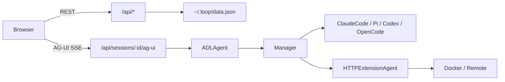

# CLAUDE.md

This file provides guidance to Claude Code (claude.ai/code) when working with code in this repository.

## Commands

### Backend (Go)
```sh
go build ./...          # compile
go test ./...           # run tests
go run . ui             # build + run server on :8080
go run . ui --port 3000 # custom port (use this for development)
go run . ui -a "Claude Code" -m "Review README" -w .  # create session + initial prompt
```

### Frontend (run from `ui/`)
```sh
npm install
npm run dev     # Vite dev server with HMR (proxies /api to Go server)
npm run build   # compile to ui/dist (required before go build)
npm run lint    # ESLint
```

### Full production build
```sh
cd ui && npm run build && cd .. && go build -o loop_bin . && ./loop_bin ui
```

> `ui/dist` must exist before `go build` — it is embedded into the binary at compile time via `//go:embed ui/dist`.

### Docker images (run from `docker/`)
```sh
docker build -f claude-code/Dockerfile -t loop-claude-code:latest .
docker build -f pi/Dockerfile          -t loop-pi:latest           .
docker build -f codex/Dockerfile       -t loop-codex:latest        .
docker build -f opencode/Dockerfile    -t loop-opencode:latest     .
```

All docker sandbox images listen on port **8090** and share `http_loop_agent.py`. They forward `ANTHROPIC_API_KEY`, `ANTHROPIC_BASE_URL`, `OPENAI_API_KEY`, and `OPENAI_BASE_URL` from the host. Loop adds `--add-host=<hostname>:host-gateway` when a base URL resolves to loopback.

## Architecture

### Request flow



In development, Vite (`:5173`) proxies `/api` to the Go server.

### Go packages

| Package | Role |
|---|---|
| `cmd/` | Cobra CLI (`loop ui [--port] [--agent-type] [--prompt] [--working-dir]`) |
| `internal/server/` | HTTP mux, REST handlers, AG-UI streaming (`agui.go`), MCP tool UI (`mcp_manager.go`) |
| `internal/model/` | `Session`, `ChatMessage`, ADL structs |
| `internal/store/` | Persistence: `data.json` (sessions, agent session IDs, UI messages), `settings.json`, ADL YAML in `agents/`, agent history loaders |
| `internal/agent/` | `Agent` interface, harness agents, `ADLAgent` executor, `Manager` lifecycle, `sandbox.go` (bwrap) |

### Agent interface

```go
type Agent interface {
    Name() string
    Run(ctx context.Context, req RunRequest, events chan<- Event) error
}
```

Every session resolves to an ADL definition via `findADLDef()`. `ADLAgent` dispatches to the correct harness per step (or top-level harness for single-step agents).

#### Builtin harnesses (Go-managed subprocesses)

| Harness | Agent struct | CLI |
|---|---|---|
| `claude-code` | `ClaudeCodeAgent` | `claude -p … --output-format stream-json` (persistent session via `claude_session.go`) |
| `pi` | `PiAgent` | `pi --mode rpc` (JSON-RPC over stdin/stdout via `pi_session.go`) |
| `codex` | `CodexAgent` | `codex exec … --json` (JSONL via `codex_session.go`) |
| `opencode` | `OpenCodeAgent` | `opencode serve` + `opencode run --attach` (via `opencode_session.go`) |

Sandbox is set from ADL `harness.sandbox` and propagated via `harnessBuiltinConfig()` → `Manager.getBuiltinAgent()`. Bubblewrap only applies when `sandbox: bubblewrap` (Linux only); `none` runs unsandboxed on the host.

Bind mounts per harness when bwrap is active:
- `claude-code` → `~/.claude`
- `pi` → `~/.pi`
- `codex` → `~/.codex`
- `opencode` → `~/.local/share/opencode`

#### Connector harnesses (HTTP/SSE)

| Harness | Agent struct | Lifecycle |
|---|---|---|
| `docker` | `HTTPExtensionAgent` | Loop runs `docker run -d -p 127.0.0.1::<port> <image>`, maps port, health-checks `GET /info` |
| `remote` | `HTTPExtensionAgent` | Loop stores `host:port`; no process management |

`Manager` also provides `GetClaudeCodeDocker`, `GetPiDocker`, `GetCodexDocker`, `GetOpenCodeDocker` for `sandbox: docker` on builtin harnesses (images `loop-*:latest`, port 8090).

On delete/shutdown, Loop calls `POST /shutdown` on managed containers, then `docker stop`.

#### Reference code (not wired to Manager)

- `ExtensionAgent` in `extension.go` — TCP JSON-RPC 2.0 client; implemented but not called by `Manager.GetAgent()`
- `extensions/` and `dev/extension-examples/py|ts/` — reference TCP JSON-RPC frameworks for custom extension authors

### HTTP/SSE protocol (docker + remote)

| Endpoint | Description |
|---|---|
| `GET /info` | Health check + metadata |
| `POST /run` | Body: `{message, sessionId?, workingDir?, systemPrompt?, model?}` → `text/event-stream` |
| `POST /cancel` | Body: `{runId}` — cancel current run |
| `POST /shutdown` | Stop subprocesses; used by Loop on container teardown |

SSE `data:` events support `text`, `done`, `error`, and tool-call/image event types (see `eventFromHarnessParams` in `extension.go`).

### Persistence

| File | Contents |
|---|---|
| `~/.loop/data.json` | `sessions`, `agentSessions` (loop session ID → agent session ID), `sessionMessages` (UI chat text) |
| `~/.loop/settings.json` | `theme`, `lastAgentType`, `lastSessionId`, `sidebarOpen` |
| `~/.loop/agents/*.yaml` | User ADL definitions; loaded on every `GET /api/agent-types` |
| Agent history files | Claude: `~/.claude/projects/<dirHash>/<id>.jsonl`; pi/codex/opencode via respective `store/*_history.go` loaders |

UI loads persisted `sessionMessages` first on session select; falls back to agent history files if empty.

### API routes

Registered in `internal/server/api.go` and `agui.go`:

- `GET/POST /api/sessions` — list / create (docker/remote ADL agents validated on create via `validateSessionConnector`)
- `GET/PATCH/DELETE /api/sessions/:id` — get / rename / delete
- `GET/PUT /api/sessions/:id/messages` — persisted UI messages
- `POST /api/sessions/:id/ag-ui` — **primary chat endpoint** (AG-UI protocol)
- `POST /api/sessions/:id/chat` — legacy raw agent events (unused by UI)
- `GET /api/sessions/:id/history` — agent-side session history
- `GET /api/agent-types` — builtin + user ADL types
- `GET /api/directories` — working-dir autocomplete
- `GET/PUT /api/settings` — user preferences (partial PUT supported)
- `GET /api/bootstrap` — one-shot CLI bootstrap (`sessionId`, `initialPrompt`); consumed on first read
- `GET /api/capabilities` — bwrap availability

### Frontend structure

- `App.tsx` — session list + selection; restores `lastSessionId`, `sidebarOpen`, and CLI bootstrap prompt
- `useSessionChat.ts` — AG-UI client (`@ag-ui/client`); handles text, tool calls, images, MCP app frames
- `ChatPanel.tsx` / `ConversationPanel.tsx` — chat UI
- `NewSessionDialog.tsx` — builtin harness pills + custom ADL agent cards
- `api.ts` — REST client
- `types.ts` — TypeScript mirrors of Go model structs

### ADL executor status

Implemented in `internal/agent/adl.go`:
- Topological step scheduling (`dependsOn`)
- Per-step harness/model/systemPrompt override
- Named outputs → downstream inputs
- All six harness types + sandbox variants

**Not yet enforced** (parsed from YAML but ignored at runtime):
- Step `policy` (`parallel`, `loop`, `batch`, etc.) — all steps run sequentially
- `approval` / `approvalTimeout` (HITL gates)
- `constraints` (timeout, maxTokens, retries)
- `schedule.cron` (autonomous mode)
- `tools.mcp` configuration

### UI stack

Tailwind CSS v4, shadcn/ui on Base UI (`@base-ui/react`), `react-markdown` + `rehype-highlight`, `@ag-ui/client` for streaming.
