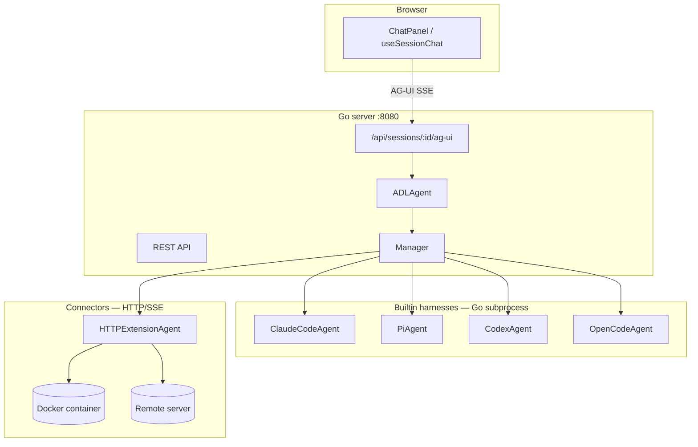

# Developer guide

This document covers building, contributing to, and releasing nui. For day-to-day usage, see [README.md](README.md).

## Documentation

- [Product & technical spec](dev/dev.md) — architecture, roadmap, API surface
- [ADL](dev/adl/design.md) — Agent Definition Language schema and examples
- [Harness protocols](dev/harness-design.md) — HTTP/SSE and JSON-RPC for custom harnesses
- [Extension API](dev/extension-api.md) — extension manifest, HITL, deployers

## Architecture



**Session flow:** every session has an `agentType` that resolves to an ADL definition (built-in or `~/.nui/agents/*.yaml`). `ADLAgent` runs the harness — single-step for simple agents, multi-step DAG for workflows. The UI streams chat over the [AG-UI protocol](https://github.com/ag-ui-protocol/ag-ui) at `POST /api/sessions/:id/ag-ui`, not the legacy `/chat` endpoint.

## Prerequisites

- Go 1.22+
- Node.js 18+
- Agent CLIs on `PATH` as needed: `claude`, `pi`, `codex`, `opencode`
- Docker (optional) — for `sandbox: docker`, custom docker-harness ADL agents, and devcontainer harnesses
- Dev Container CLI (optional) — for `harness.type: devcontainer` (`npm install -g @devcontainers/cli`)

## Project structure

```
nui/
├── main.go, embed.go          # entrypoint; embeds ui/dist
├── cmd/                       # cobra CLI (`nui server`, `nui extension`, `nui skills`)
├── internal/
│   ├── model/                 # Session, ChatMessage, ADL structs
│   ├── agent/                 # Agent interface, harness implementations, ADL executor
│   ├── server/                # HTTP mux, REST + AG-UI streaming
│   └── store/                 # JSON persistence (~/.nui/)
├── docker/                    # Builtin sandbox images (HTTP/SSE, port 8090)
├── harness-sdk/               # Python extension author SDK (see harness-sdk/README.md)
├── dev/
│   ├── dev.md                 # product spec
│   ├── harness-design.md      # custom harness protocols
│   └── harness-examples/      # runnable docker/remote/TCP examples
└── ui/                        # Vite + React frontend
```

## Running in development

Terminal 1 — Vite dev server (proxies `/api` to Go):

```sh
cd ui && npm install && npm run dev
```

Terminal 2 — Go server (`ui/dist` must exist before `go build`):

```sh
cd ui && npm run build && cd ..
go run . server              # default :8080
go run . server --port 3000  # custom port
```

Production build:

```sh
cd ui && npm run build && cd .. && go build -o nui_bin . && ./nui_bin server
```

## API endpoints

Full reference: [`dev/dev.md`](dev/dev.md#api-surface).

| Path | Description |
|---|---|
| `/` | React SPA |
| `/assets/*` | Static assets (embedded from `ui/dist`) |
| `/health` | JSON health check |
| `GET/POST /api/sessions` | List / create sessions |
| `POST /api/sessions/ensure-default` | Return or create the default session |
| `GET /api/sessions/events` | Global session list SSE (`changed`) |
| `GET/PATCH/DELETE /api/sessions/:id` | Get / rename / delete a session |
| `GET/PUT /api/sessions/:id/messages` | Read / replace persisted UI messages |
| `POST/GET /api/sessions/:id/uploads[/:file]` | File uploads for chat attachments |
| `GET /api/sessions/:id/mentions` | @-mention autocomplete |
| `POST /api/sessions/:id/ag-ui` | **Primary chat** — AG-UI SSE stream |
| `POST /api/sessions/:id/runs` | Start async headless run (`202` + `runId`) |
| `GET /api/sessions/:id/runs` | List runs for a session |
| `GET /api/sessions/:id/runs/:runId` | Run status |
| `GET /api/sessions/:id/runs/:runId/events` | SSE run events with `Last-Event-ID` replay |
| `POST /api/sessions/:id/runs/:runId/hitl` | Create HITL request scoped to run |
| `POST /api/sessions/:id/stop` | Cancel in-flight run |
| `POST /api/sessions/:id/chat` | Legacy raw agent-event SSE (unused by UI) |
| `GET /api/sessions/:id/history` | Load history from agent session files |
| `GET /api/agent-types` | Builtin + user + extension ADL agent types |
| `GET /api/directories` | Working-directory autocomplete |
| `GET/PUT /api/settings` | User preferences (theme, last agent/session, sidebar, disabled extensions) |
| `GET /api/bootstrap` | One-shot CLI bootstrap state (`sessionId`, `initialPrompt`) |
| `POST /api/launch` | Create session + optional initial prompt |
| `GET /api/capabilities` | Sandbox capabilities (bwrap availability) |
| `GET /api/extensions` | Installed extensions |
| `POST /api/extensions/reload` | Rescan extensions |
| `GET/PUT /api/mcp-servers` | User MCP server config |
| `GET/DELETE /api/skills[/:name]` | Skill catalog |
| `GET/POST/PUT/DELETE /api/agents[/:file]` | User ADL agent CRUD |
| `POST /api/agents/:id/deploy` | Deploy agent via extension deployer |
| `GET /api/agent-deployers` | List deployers |
| `GET/POST/PATCH/DELETE /api/schedules[/:id]` | Schedule CRUD |
| `POST /api/schedules/:id/run-now` | Trigger schedule immediately |
| `POST/GET /api/hitl/requests[/:id]` | HITL requests (create, list, wait, respond) |
| `GET /api/hitl-channels` | Available HITL delivery channels |
| `POST /mcp-call-tool`, `GET /mcp-resource` | MCP proxy for UI tool frames |

## Agent types (reference)

### Built-in agents

Ten built-in agent types: four CLI harnesses, five API harnesses, and the `nui` master agent. Select them under **Built-in** in the New Session panel (CLI and API tabs).

**CLI harnesses:**

| Name | Harness | Runs |
|---|---|---|
| Claude Code | `claude-code` | `claude` CLI subprocess |
| pi | `pi` | `pi --mode rpc` subprocess |
| codex | `codex` | `codex exec` subprocess |
| opencode | `opencode` | `opencode serve` + `opencode run` |

**API harnesses** (`harness.type: api` — in-process via `internal/llm/`):

| Name | Provider | Default model | API key env |
|---|---|---|---|
| Claude API | `anthropic` | `claude-sonnet-4-20250514` | `ANTHROPIC_API_KEY` |
| OpenAI | `openai` | `gpt-4o-mini` | `OPENAI_API_KEY` |
| Gemini | `gemini` | `gemini-2.5-flash` | `GEMINI_API_KEY` / `GOOGLE_API_KEY` |
| OpenRouter | `openrouter` | `anthropic/claude-sonnet-4` | `OPENROUTER_API_KEY` |
| Ollama | `ollama` | (none) | none (`OLLAMA_HOST` optional) |

Definitions live in `internal/agents/api_builtins.go`. Availability is checked via `APIHarnessAvailable()` in `internal/agent/api_availability.go`. See [harness-design.md](dev/harness-design.md) §4 for ADL fields (`provider`, `model`, `baseURL`, `apiKeyEnv`).

### Installed agents

ADL YAML from `~/.nui/agents/*.yaml`, extensions, and other non-built-in agent types. Select them under **Installed agents** in the New Session panel. Example templates for `docker`, `devcontainer`, and `remote` harness types live under [`dev/harness-examples/`](dev/harness-examples/); general ADL samples live in [`dev/adl/examples/`](dev/adl/examples/).

Use custom ADL for `docker`, `devcontainer`, and `remote` harness types, sandbox variants (`bubblewrap`, `docker`), and multi-step workflows.

### Sandbox options

For `claude-code`, `pi`, `codex`, and `opencode` (set in ADL `harness.sandbox`):

| Value | Behavior |
|---|---|
| `none` | Run on host (default) |
| `bubblewrap` | Wrap subprocess with `bwrap` (Linux only) |
| `docker` | Run in a nui-managed container (`nui-<harness>:latest`, port **8090**) |

### Docker / remote connectors

Custom ADL agents with `harness.type: docker`, `devcontainer`, or `remote` use the HTTP/SSE protocol. nui validates connector configuration on session create; containers and remote connections start on the first message. See [harness examples](dev/harness-examples/).

**Port note:** builtin sandbox images in `docker/` listen on **8090**; custom harness examples use **9090** (configured via ADL `containerPort`).

### Agent evals

ADL agents can define `evals:` test cases. Run them against a running server:

```sh
nui agent eval run -a my-agent
nui agent eval run -a my-agent --case smoke --parallel 2
```

Or via HTTP: `POST /api/agents/:id/evals/run`. Implementation: `internal/eval/runner.go`, CLI: `cmd/agent_eval.go`.

### Built-in MCP servers (injected into harnesses)

| Server | CLI | Tools |
|---|---|---|
| `nui-hitl` | `nui hitl-mcp` | `ask_user`, approval flows |
| `nui-viz` | `nui viz-mcp` | `show_visualization` (inline charts in chat) |
| `nui-agent` | `nui agent-mcp` | `save_agent`, `update_memory` |

Source: `internal/mcpserver/`. Harness config injects these when HITL, visualization, or memory features are enabled (`internal/agent/harness_config*.go`).

### Known limitations

- **Persistence:** UI text messages persist; tool-call payloads and image attachments do not survive server restart.
- **AG-UI replay:** Mid-stream reconnect offset replay is planned but not implemented.
- **Sandboxing:** Bubblewrap (`harness.sandbox: bubblewrap`) is Linux-only. macOS `sandbox-exec` is not implemented.
- **Legacy endpoints:** `POST /api/sessions/:id/chat` and `GET /api/sessions/:id/history` remain registered but the UI uses AG-UI exclusively.
- **Reference harnesses:** TCP JSON-RPC examples in `dev/harness-examples/py/` and `ts/` are not registered as built-in agent types.

## Contributing

CI runs on every pull request and push to `main`:

- Go tests (`go test -coverprofile=coverage.out . ./cmd/... ./internal/...`)
- harness-sdk pytest (`pytest harness-sdk`)
- UI lint, build, and Vitest unit tests (with coverage artifacts)
- Playwright end-to-end tests
- Binary size budget check

Run the full suite locally:

```sh
./scripts/test-all.sh
```

## Releasing

1. Bump [`VERSION`](VERSION) on `main` to match the upcoming tag (without the `v` prefix).
2. Tag and push: `git tag v0.2.0 && git push origin v0.2.0`
3. Create a GitHub Release for the tag (`gh release create v0.2.0 --generate-notes`).
4. The release workflow builds Linux and macOS binaries (amd64 + arm64) and attaches them to the release.

Build release archives locally:

```sh
./scripts/build-release.sh v0.2.0
```

Artifacts land in `dist/` as `nui_<tag>_<os>_<arch>.tar.gz` (or `.zip` on Windows) plus `checksums.txt`.

### Serving the install script

The installers live at [`install/install.sh`](install/install.sh) (Unix) and [`install/install.ps1`](install/install.ps1) (Windows). To serve them at `https://nui.plmbr.dev/`:

1. Enable **GitHub Pages** for this repository (source: `main` branch, `/install` folder).
2. Add a DNS `CNAME` record: `nui.plmbr.dev` → `<user>.github.io` (the [`install/CNAME`](install/CNAME) file is already in the repo).
3. Verify: `curl -fsSL https://nui.plmbr.dev/install.sh | head`

### Future macOS codesigning

When an Apple Developer ID is available, add a `sign-macos` job to the release workflow with these GitHub secrets: `APPLE_CERTIFICATE_P12`, `APPLE_CERTIFICATE_PASSWORD`, `APPLE_ID`, `APPLE_APP_PASSWORD`, `APPLE_TEAM_ID`. Sign with hardened runtime, notarize via `notarytool`, and staple before uploading darwin assets.
