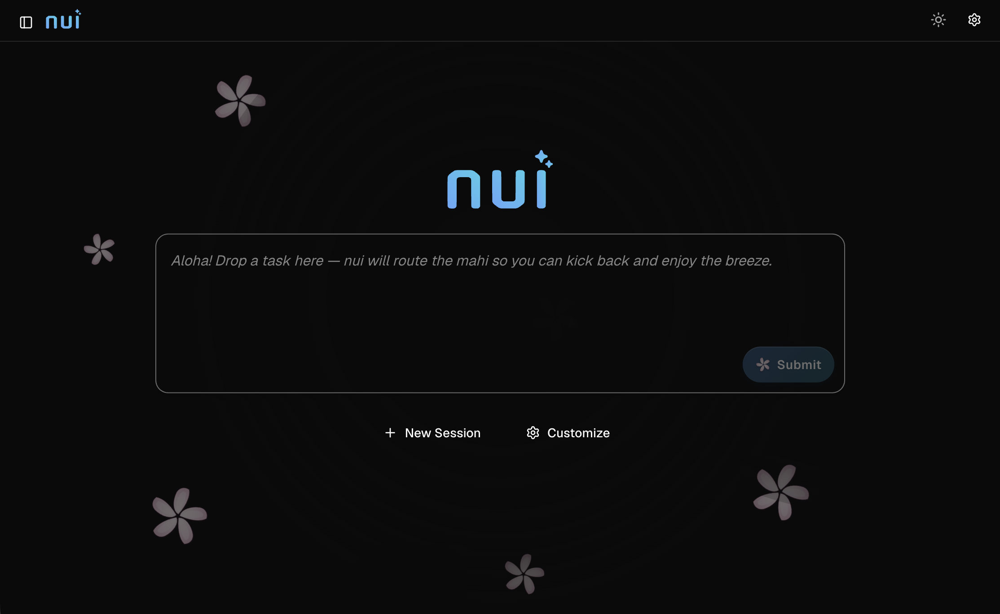

# nui

nui is a self-hosted web UI for interactive AI agent sessions. Run agents locally in your terminal, in Docker, or on a remote server — all from one interface.



## Install

**Linux and macOS** (installs to `~/.local/bin`):

```sh
curl -fsSL https://nui.plmbr.dev/install.sh | sh
```

**Windows** (installs to `%LOCALAPPDATA%\nui` and adds it to your user `PATH`):

```powershell
irm https://nui.plmbr.dev/install.ps1 | iex
```

Install a specific version:

```sh
NUI_VERSION=v0.4.0-alpha curl -fsSL https://nui.plmbr.dev/install.sh | sh
```

```powershell
$env:NUI_VERSION = "v0.4.0-alpha"; irm https://nui.plmbr.dev/install.ps1 | iex
```

**Manual install:** download the archive for your platform from [GitHub Releases](https://github.com/plmbr/nui/releases), extract the `nui` binary (or `nui.exe` on Windows), and place it on your `PATH`.

**macOS note:** release binaries and the desktop `.app` are currently **not** Developer ID–notarized. The CLI install script strips quarantine and ad-hoc codesigns the binary automatically. If you install manually or download `nui.app`:

```sh
xattr -cr /path/to/nui          # CLI binary
codesign -s - -f /path/to/nui  # required if `nui` exits with "zsh: killed"
xattr -cr /path/to/nui.app      # desktop app
```

Then open the app (right-click → Open the first time, or `open nui.app`). If macOS still blocks it, allow it under **System Settings → Privacy & Security**. Full notarization needs an Apple Developer ID (see DEVELOPERS.md).

## Quick start

Start the server:

```sh
nui server
```

Open [http://localhost:8080](http://localhost:8080), pick an agent, and start chatting. nui creates a session automatically on first launch.

Launch with a specific agent and prompt:

```sh
nui server --agent-type claude-code --prompt "Review the README" --open
```

## Prerequisites

Install the agent CLI you want to use and make sure it is on your `PATH`:

| Agent (ADL id) | CLI command |
|---|---|
| `claude-code` | `claude` |
| `pi` | `pi` |
| `codex` | `codex` |
| `opencode` | `opencode` |

**API agents** (no CLI required) use provider API keys instead:

| Agent | API key environment variable |
|---|---|
| Claude API | `ANTHROPIC_API_KEY` (or `ANTHROPIC_AUTH_TOKEN`) |
| OpenAI | `OPENAI_API_KEY` |
| Gemini | `GEMINI_API_KEY` or `GOOGLE_API_KEY` |
| OpenRouter | `OPENROUTER_API_KEY` |
| Ollama | none (local; optional `OLLAMA_HOST`) |

**Optional:**

- **Docker** — for sandboxed built-in agents and custom Docker-based agents
- **Dev Container CLI** — for devcontainer harness agents (`npm install -g @devcontainers/cli`)

## Using the UI

1. **Home launcher** — type a task on the home screen; the built-in `nui` master agent routes it to the best specialist (or helps you create one).
2. **New session** — choose a built-in or installed agent and a working directory.
3. **Chat** — send prompts, attach files, and use `@` mentions for context.
4. **Sessions** — switch between past sessions from the sidebar; rename or delete as needed.
5. **Settings** — toggle light/dark theme, manage extensions, and configure MCP servers (including OAuth for remote MCP).

Preferences (theme, last agent, sidebar state) are saved to `~/.nui/settings.json` and restored on reload.

## CLI reference

```
nui server              # start web server on :8080
nui server --port 3000  # custom port
nui server --open       # open browser with a new session
nui server --no-browser # headless daemon (no browser)
nui run -a claude-code -m "Review README" --wait  # headless run
nui run -m "Summarize" --spawn --wait             # auto-start server if needed
nui agent list|add|remove|deploy|deployers
nui agent eval run -a my-agent  # run ADL eval cases against a running server
nui extension add|list|remove|create  # manage / scaffold extensions
nui skills add|list|remove  # manage skills catalog
nui memory list|show|edit  # persistent memory files
nui schedule list|add|enable|disable|delete|run-now  # recurring runs
nui harness-sdk reinstall  # copy Python SDK to ~/.nui/harness-sdk/
```

### Launch flags

| Flag | Short | Description |
|---|---|---|
| `--open` | | Open the web UI in your browser with a new session |
| `--no-browser` | | Do not open a browser (daemon mode) |
| `--agent-type` | `-a` | ADL agent id to launch (e.g. `claude-code`, `pi`, `anthropic`, `nui`) |
| `--prompt` | `-m` | Initial prompt sent automatically |
| `--hide-input` | | Hide the chat input (use with `--prompt`) |
| `--working-dir` | `-w` | Working directory for the session |
| `--theme` | | UI theme: `light` or `dark` |
| `--default-agent` | | Default ADL agent id for new sessions (saved to `~/.nui/settings.json`) |
| `--default-harness` | | Default harness for internal agents (e.g. `api/anthropic`, `claude-code`; saved to settings) |

### Headless runs

Run an agent without opening the browser (server must be running):

```sh
nui run -m "Review README" -w .
nui run -a claude-code -m "Review README" -w . --wait
```

Set `NUI_URL` or pass `--url` if the server is not on `http://127.0.0.1:8080`. Use `--spawn` to start `nui server` in the background if it is not already running.

## Agents

### Built-in agents

**Master agent** (home launcher / routing):

| ADL id | Description |
|---|---|
| `nui` | Master agent — routes tasks to specialists via `nui-orchestrator` MCP (`list_agents`, `launch_session`), or helps create agents |

**CLI agents** (require the corresponding binary on `PATH`):

| ADL id | Description |
|---|---|
| `claude-code` | Anthropic's Claude Code CLI |
| `pi` | pi agent CLI |
| `codex` | OpenAI Codex CLI |
| `opencode` | OpenCode CLI |

**API agents** (in-process LLM calls; selectable under built-in agents in the New Session panel):

| ADL id | Name | Description |
|---|---|---|
| `anthropic` | Claude API | Claude models via the Anthropic API |
| `openai` | OpenAI | GPT models via the OpenAI API |
| `gemini` | Gemini | Google Gemini via the Gemini API |
| `openrouter` | OpenRouter | Multi-model routing via OpenRouter |
| `ollama` | Ollama | Local models via Ollama |

See [harness design](dev/harness-design.md) for API harness configuration and env vars.

### Custom agents

Install your own agent definitions (ADL YAML) to `~/.nui/agents/`:

```sh
nui agent add ./my-agent.yaml
```

Custom agents appear under **Installed agents** in the New Session panel. They can run in Docker, dev containers, remote servers, or sandboxes. See the [ADL examples](dev/adl/examples/) and [harness examples](dev/harness-examples/) for templates.

## Extensions

Extensions add harnesses, MCP servers, skills, and agents. Install from a local directory, zip file, or git URL:

```sh
nui extension add ./my-extension
nui extension add https://github.com/example/my-extension.git
nui extension list
nui extension remove my-extension
```

Manage installed extensions from the **Settings → Extensions** tab, or disable individual extensions without uninstalling.

## MCP integration

Expose nui agents to MCP hosts (Cursor, Claude Desktop, etc.) by adding this to your MCP config:

```json
{
  "mcpServers": {
    "nui": {
      "command": "nui",
      "args": ["mcp"],
      "env": { "NUI_URL": "http://127.0.0.1:8080" }
    }
  }
}
```

Install the CLI via [the install script](#install), a release archive, or by
opening the **desktop app** once (it bundles `nui` and installs it to
`~/.local/bin` / `%LOCALAPPDATA%\nui` on first launch). Restart the MCP host
after install so it picks up PATH changes.

Available tools: `list_agents`, `list_sessions`, `create_session`, `run_agent`, `get_run`, `get_run_events`, `stop_run`.

nui also injects built-in MCP servers into agent harnesses when configured:

| MCP server | Command | Purpose |
|---|---|---|
| `nui-hitl` | `nui hitl-mcp` | Human-in-the-loop prompts (`ask_user`, approvals) |
| `nui-viz` | `nui viz-mcp` | Inline chart/visualization rendering in chat |
| `nui-agent` | `nui agent-mcp` | Save ADL agents (`save_agent`) and update memory (`update_memory`) |
| `nui-orchestrator` | `nui orchestrator-mcp` | Launcher routing (`list_agents`, `launch_session`) for the `nui` master agent |

## Known limitations

- Tool-call details and image attachments are not persisted across server restarts (text messages are).
- AG-UI mid-stream replay after reconnect is not yet implemented.
- Bubblewrap sandboxing is Linux-only; macOS native sandboxing is not implemented.
- TCP JSON-RPC harness examples under `dev/harness-examples/py/` and `ts/` are reference-only and not wired as built-in agent types.

## Further reading

- [Developer guide](DEVELOPERS.md) — build from source, API reference, contributing, releasing
- [Product & technical spec](dev/dev.md) — architecture and roadmap
- [Extension API](dev/extension-api.md) — extension manifest, HITL, deployers
- [Harness protocols](dev/harness-design.md) — custom harness HTTP/SSE and JSON-RPC
- [ADL](dev/adl/design.md) — Agent Definition Language schema and examples
