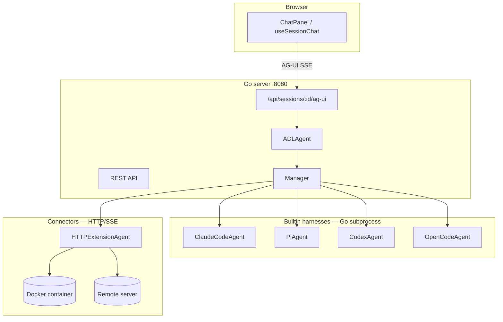

# nui

nui is a self-hosted UI for interactive AI agent sessions. A Go backend embeds a React frontend and runs agent harnesses locally, in Docker, or over the network.


## Documentation

- [Product & technical spec](dev/dev.md) — architecture, ADL schema, roadmap
- [Harness protocols](dev/harness-design.md) — HTTP/SSE and JSON-RPC for custom harnesses
- [Extension API](dev/extension-api.md) — extension manifest, HITL, deployers
- [ADL examples](dev/adl/examples/) — sample agent/workflow YAML files

## Architecture



**Session flow:** every session has an `agentType` that resolves to an ADL definition (built-in or `~/.nui/agents/*.yaml`). `ADLAgent` runs the harness — single-step for simple agents, multi-step DAG for workflows. The UI streams chat over the [AG-UI protocol](https://github.com/ag-ui-protocol/ag-ui) at `POST /api/sessions/:id/ag-ui`, not the legacy `/chat` endpoint.

## Prerequisites

- Go 1.22+
- Node.js 18+
- Agent CLIs on `PATH` as needed: `claude`, `pi`, `codex`, `opencode`
- Docker (optional) — for `sandbox: docker`, custom docker-harness ADL agents, and devcontainer harnesses
- Dev Container CLI (optional) — for `harness.type: devcontainer` (`npm install -g @devcontainers/cli`)

## Project structure

```
nui/
├── main.go, embed.go          # entrypoint; embeds ui/dist
├── cmd/                       # cobra CLI (`nui ui`, `nui extension`, `nui skills`)
├── internal/
│   ├── model/                 # Session, ChatMessage, ADL structs
│   ├── agent/                 # Agent interface, harness implementations, ADL executor
│   ├── server/                # HTTP mux, REST + AG-UI streaming
│   └── store/                 # JSON persistence (~/.nui/)
├── docker/                    # Builtin sandbox images (HTTP/SSE, port 8090)
├── harness-sdk/               # Python extension author SDK (see harness-sdk/README.md)
├── dev/
│   ├── dev.md                 # product spec
│   ├── harness-design.md      # custom harness protocols
│   ├── harness-examples/      # runnable docker/remote/TCP examples
│   └── adl/examples/          # sample ADL YAML
└── ui/                        # Vite + React frontend
```

## Running in development

Terminal 1 — Vite dev server (proxies `/api` to Go):

```sh
cd ui && npm install && npm run dev
```

Terminal 2 — Go server (`ui/dist` must exist before `go build`):

```sh
cd ui && npm run build && cd ..
go run . ui              # default :8080
go run . ui --port 3000  # custom port
```

Production build:

```sh
cd ui && npm run build && cd .. && go build -o nui_bin . && ./nui_bin ui
```

## CLI

```
nui ui              # start web server on :8080
nui ui --port 3000  # custom port
nui ui -p 3000      # shorthand
nui ui --open       # open http://localhost:8080 with a new blank session
nui run -a claude-code -m "Review README" --wait  # headless run via REST API
nui agent list      # list agent types (requires nui ui)
nui agent add ./my-agent.yaml  # install ADL to ~/.nui/agents/ (offline)
nui agent deploy ext:docker-deployer/docker my-agent  # deploy via extension deployer
nui agent deployers # list installed agent deployers
nui mcp             # MCP server (stdio) for agent discovery and runs
nui hitl-mcp        # HITL tools MCP server (stdio)
nui viz-mcp         # Visualization MCP server (stdio) for show_visualization
nui extension add   # install extension from git URL, directory, or zip
nui extension remove # remove installed extension by id
nui skills add|list|remove  # manage ~/.nui/skills/ catalog
nui schedule list|add|enable|disable|delete|run-now  # recurring autonomous runs
```

### Launch an agent from the CLI

Create a session on startup and optionally run an initial prompt in the UI:

```sh
nui ui --agent-type "Claude Code" --prompt "Review the README" --open
nui ui -a pi -m "Summarize this repo" --open --hide-input
```

| Flag | Short | Description |
|---|---|---|
| `--open` | | Open the web UI in the system default browser. Creates a new blank session with the default agent and selects it (instead of resuming the last session). |
| `--agent-type` | `-a` | ADL agent name (builtin or `~/.nui/agents/*.yaml`). Creates a new session on startup and starts with the sidebar closed. |
| `--prompt` | `-m` | Initial prompt. The UI auto-sends it in the new session. Also starts with the sidebar closed. |
| `--hide-input` | | Hide the chat input field (for one-off runs; use with `--prompt`). |
| `--working-dir` | `-w` | Working directory for the session (defaults to the current directory). |
| `--theme` | | UI theme: `light` or `dark` (saved to `~/.nui/settings.json`). |
| `--default-agent` | | Default agent type for new sessions (ADL id or display name; saved to `~/.nui/settings.json`). |

Agent type names match the New Session dialog — e.g. `Claude Code`, `pi`, `codex`, `opencode`, or a custom ADL name like `docker-echo`. Legacy aliases such as `claude-code` also work.

On startup nui (when `-a`, `-m`, or `--open` is passed):

1. Binds the HTTP server and prints `Listening on ...`
2. Creates the session (same as `POST /api/launch`) and validates docker/remote connectors if needed
3. Saves `lastAgentType` and `lastSessionId` to `~/.nui/settings.json`
4. Exposes the prompt once via `GET /api/bootstrap` for the UI to consume
5. Opens the browser to `/sessions/<id>` when `--open` is set

If no sessions exist when the server starts (and no launch flags were passed), nui automatically creates one using `lastAgentType` from settings, or the first available built-in agent (`Claude Code`, `pi`, `codex`, or `opencode`) when the UI loads.

### Headless runs (`nui run`)

With the server running (`nui ui`), start an agent without the browser:

```sh
nui run -m "Review README" -w .              # uses default agent from settings
nui run -a claude-code -m "Review README" -w .
nui run --session-id <id> -m "follow up" --no-wait
```

Set `NUI_URL` or pass `--url` if the server is not on `http://127.0.0.1:8080`. Use `--spawn` to background-start `nui ui` when unreachable.

### MCP server (`nui mcp`)

Expose nui agents to MCP hosts (Cursor, Claude Desktop, etc.):

```json
{
  "mcpServers": {
    "nui": {
      "command": "nui",
      "args": ["mcp"],
      "env": { "NUI_URL": "http://127.0.0.1:8080" }
    }
  }
}
```

Tools: `list_agents`, `list_sessions`, `create_session`, `run_agent`, `get_run`, `get_run_events`, `stop_run`.

### Extensions

Install backend extensions (harnesses, MCP servers, skills, agents) into `~/.nui/extensions/`:

```sh
nui extension add dev/extension-examples/corp-pack
nui extension add https://github.com/example/my-extension.git
nui extension add ./corp-pack.zip
nui extension remove corp-pack
```

Sources: local directory, `.zip` file, or git URL. See [`dev/extension-api.md`](dev/extension-api.md) for the manifest format.

### User preferences

Stored in `~/.nui/settings.json` and restored on reload:

| Field | Saved when | Restored as |
|---|---|---|
| `theme` | Settings sheet toggle | Light/dark theme |
| `lastAgentType` | Session create (UI or CLI) | Default in New Session dialog |
| `lastSessionId` | Session selection | Auto-select on startup (if session still exists) |
| `sidebarOpen` | Sidebar toggle | Sidebar expanded/collapsed state (offcanvas — no gutter when closed) |
| `disabledExtensions` | Extensions tab toggle | Extension contributions excluded at runtime |

`PUT /api/settings` accepts partial updates — send only the fields you want to change.

## API endpoints

Full reference: [`dev/dev.md`](dev/dev.md#api-surface).

| Path | Description |
|---|---|
| `/` | React SPA |
| `/assets/*` | Static assets (embedded from `ui/dist`) |
| `/health` | JSON health check |
| `GET/POST /api/sessions` | List / create sessions |
| `POST /api/sessions/ensure-default` | Return or create the default session |
| `GET /api/sessions/events` | Global session list SSE (`changed`) |
| `GET/PATCH/DELETE /api/sessions/:id` | Get / rename / delete a session |
| `GET/PUT /api/sessions/:id/messages` | Read / replace persisted UI messages |
| `POST/GET /api/sessions/:id/uploads[/:file]` | File uploads for chat attachments |
| `GET /api/sessions/:id/mentions` | @-mention autocomplete |
| `POST /api/sessions/:id/ag-ui` | **Primary chat** — AG-UI SSE stream |
| `POST /api/sessions/:id/runs` | Start async headless run (`202` + `runId`) |
| `GET /api/sessions/:id/runs` | List runs for a session |
| `GET /api/sessions/:id/runs/:runId` | Run status |
| `GET /api/sessions/:id/runs/:runId/events` | SSE run events with `Last-Event-ID` replay |
| `POST /api/sessions/:id/runs/:runId/hitl` | Create HITL request scoped to run |
| `POST /api/sessions/:id/stop` | Cancel in-flight run |
| `POST /api/sessions/:id/chat` | Legacy raw agent-event SSE (unused by UI) |
| `GET /api/sessions/:id/history` | Load history from agent session files |
| `GET /api/agent-types` | Builtin + user + extension ADL agent types |
| `GET /api/directories` | Working-directory autocomplete |
| `GET/PUT /api/settings` | User preferences (theme, last agent/session, sidebar, disabled extensions) |
| `GET /api/bootstrap` | One-shot CLI bootstrap state (`sessionId`, `initialPrompt`) |
| `POST /api/launch` | Create session + optional initial prompt |
| `GET /api/capabilities` | Sandbox capabilities (bwrap availability) |
| `GET /api/extensions` | Installed extensions |
| `POST /api/extensions/reload` | Rescan extensions |
| `GET/PUT /api/mcp-servers` | User MCP server config |
| `GET/DELETE /api/skills[/:name]` | Skill catalog |
| `GET/POST/PUT/DELETE /api/agents[/:file]` | User ADL agent CRUD |
| `POST /api/agents/:id/deploy` | Deploy agent via extension deployer |
| `GET /api/agent-deployers` | List deployers |
| `GET/POST/PATCH/DELETE /api/schedules[/:id]` | Schedule CRUD |
| `POST /api/schedules/:id/run-now` | Trigger schedule immediately |
| `POST/GET /api/hitl/requests[/:id]` | HITL requests (create, list, wait, respond) |
| `GET /api/hitl-channels` | Available HITL delivery channels |
| `POST /mcp-call-tool`, `GET /mcp-resource` | MCP proxy for UI tool frames |

## Agent types

### Built-in agents

Four CLI harnesses, selectable in the New Session dialog under **Built-in agents**:

| Name | Harness | Runs |
|---|---|---|
| Claude Code | `claude-code` | `claude` CLI subprocess |
| pi | `pi` | `pi --mode rpc` subprocess |
| codex | `codex` | `codex exec` subprocess |
| opencode | `opencode` | `opencode serve` + `opencode run` |

### Installed agents

ADL YAML from `~/.nui/agents/*.yaml`, extensions, and other non-built-in agent types. Select them under **Installed agents** in the New Session dialog. Example templates for `docker`, `devcontainer`, and `remote` harness types live under [`dev/harness-examples/`](dev/harness-examples/) and [`dev/adl/examples/`](dev/adl/examples/).

Use custom ADL for `docker`, `devcontainer`, and `remote` harness types, sandbox variants (`bubblewrap`, `docker`), and multi-step workflows.

### Sandbox options

For `claude-code`, `pi`, `codex`, and `opencode` (set in ADL `harness.sandbox`):

| Value | Behavior |
|---|---|
| `none` | Run on host (default) |
| `bubblewrap` | Wrap subprocess with `bwrap` (Linux only) |
| `docker` | Run in a nui-managed container (`nui-<harness>:latest`, port **8090**) |

### Docker / remote connectors

Custom ADL agents with `harness.type: docker`, `devcontainer`, or `remote` use the HTTP/SSE protocol. nui validates connector configuration on session create; containers and remote connections start on the first message. See [harness examples](dev/harness-examples/).

**Port note:** builtin sandbox images in `docker/` listen on **8090**; custom harness examples use **9090** (configured via ADL `containerPort`).
