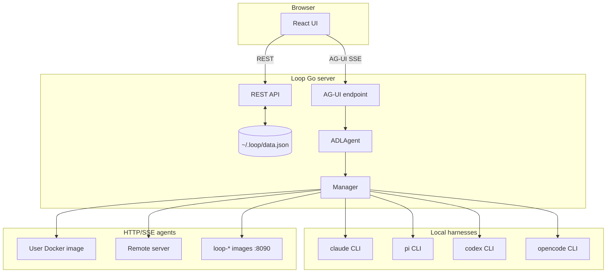

# The Loop — Product & Technical Specification

> **Status:** This document describes the product vision and the architecture **as implemented today**, with a roadmap for planned features. The Go code is the source of truth; sections marked *planned* are not yet enforced at runtime.

## Vision

The Loop is a self-hosted Go application with a bundled React web UI for creating and running AI agent sessions. Agent types are declared in ADL (Agent Definition Language); harnesses run as local subprocesses, Docker containers, or remote HTTP/SSE servers.

---

## Architecture (as built)



### Key design decisions

1. **Every session is an ADL agent.** Even the four built-in CLI harnesses are compiled-in ADL definitions (`builtinAgentDefs` in `api.go`). Selecting "Claude Code" in the UI stores `agentType: "claude-code"` (the ADL `id`), which resolves to `harness.type: claude-code`.

2. **Chat uses AG-UI, not raw SSE.** The UI (`useSessionChat.ts`) streams via `POST /api/sessions/:id/ag-ui` using the [AG-UI protocol](https://github.com/ag-ui-protocol/ag-ui). Tool calls, images, and MCP app frames are translated from agent `Event` types in `agui.go`. The legacy `POST /chat` endpoint still exists but the UI does not use it.

3. **Two custom harness transports.**
   - **Production path:** builtin harnesses are Go structs that manage CLI subprocesses; docker/remote use `HTTPExtensionAgent`.
   - **Reference path:** TCP JSON-RPC 2.0 in `dev/harness-examples/py|ts/` and `ExtensionAgent` in Go — implemented but **not wired** to `Manager.GetAgent()`. For third-party custom harnesses.

4. **Docker/remote via custom ADL.** There is no built-in "Docker" or "Remote" picker in the UI. Users select a custom ADL agent (e.g. `docker-echo` from `~/.loop/agents/docker-echo.yaml`). Loop validates the connector on session create.

5. **CLI launch + UI preferences.** `loop ui -a <agent-id> --prompt --open` creates a session at server start (`bootstrap.go`), saves `lastAgentType` / `lastSessionId` to `settings.json`, and exposes the prompt once via `GET /api/bootstrap`. `loop ui --open` (without `-a`) also creates a fresh blank session and selects it via bootstrap instead of resuming `lastSessionId`. With `--open`, Loop waits for `/health` then launches the UI in the system default browser. If no sessions exist at startup, Loop auto-creates one with the default agent. Sidebar state and last-selected session/agent are also persisted in `settings.json`.

---

## Agent Definition Language (ADL)

ADL is a YAML format for declaring an agent type or multi-step workflow. It is a **static definition** — it describes *what* an agent is, not *how* Loop executes it internally.

### Three-layer architecture

- **ADL** — agent identity, steps, harness, `aiAssets` (*this layer*)
- **MCP** — runtime tool protocol; ADL `aiAssets.mcpServers` is provisioned into per-session harness config; Loop UI MCP tool frames also use `~/.loop/.mcp.json`
- **SKILL.md** — referenced via ADL `skill` (path to skill directory or `SKILL.md`); copied into session harness config

### Schema

```yaml
adl: "1.0"

id: string                      # stable identifier; used by CLI (-a) and Session.agentType
name: string                    # display name in UI
description: string
version: semver
kind: agent | workflow          # workflow = multi-step; omitted defaults to agent

promptMode: user | auto         # auto hides input and runs default or launch prompt
defaultPrompt: string           # optional; auto mode when no launch prompt (default: built-in phrase)
workingDirInput: bool           # true = user picks working dir at session create; default uses ~/.loop/workspaces/<session-id>

harness:
  type: claude-code | pi | codex | opencode | docker | remote
  model: string
  sandbox: none | bubblewrap | docker   # subprocess harnesses only; default: none
  image: string                   # sandbox:docker or harness.type:docker
  containerPort: 9090             # harness.type:docker (user images; builtin sandbox images use 8090)
  host: string                    # harness.type:remote
  port: 9090                      # harness.type:remote
  env:                            # per-harness env (overrides top-level env on conflict)
    ANTHROPIC_API_KEY: string

env:                              # global env for all harness subprocesses
  ANTHROPIC_BASE_URL: string

systemPrompt: |
  You are ...

skill: /path/to/skill-dir        # deprecated; use aiAssets.skills

aiAssets:
  mcpServers:
    - name: my-mcp-server        # required; used as the MCP server key in harness config
      url: http://localhost:3000/mcp   # HTTP/SSE MCP (remote)
      type: http                 # http | sse (default: http when url is set)
    - name: local-mcp
      command: npx               # stdio MCP
      args: ["-y", "some-package"]
      type: stdio
  skills:
    - name: code-review          # required; install dir name in harness config
      path: ./skills/code-review # local dir or SKILL.md
    - name: commit-helper
      ref: commit-helper         # ~/.loop/skills/<ref>/skill/
    - name: greeting
      content: |                 # inline SKILL.md (including frontmatter)
        ---
        name: greeting
        description: Brief greeting skill
        ---
        Keep responses to one sentence.
    - name: shared-style
      git: https://github.com/example/agent-skills.git
      path: skills/shared-style  # required with git; relative skill dir in repo
      version: v1.0.0            # optional tag/commit

steps:                            # omit for single-step agents
  - name: research
    harness:                      # optional per-step override
      type: claude-code
      model: claude-opus-4-8
    dependsOn: []
    systemPrompt: |               # optional step override
      ...
    aiAssets:                     # optional step override
      mcpServers:
        - name: docs
          url: http://localhost:3040
          type: http
    outputs:
      - name: report
        type: text
    inputs:
      - from: other.report
        as: alias
```

Example

```yaml
adl: "1.0"
id: example-agent
name: Example Agent
description: Example Agent
harness:
  type: claude-code
  model: claude-sonnet-4-6
  env:
    ANTHROPIC_API_KEY: your-api-key

env:
  ANTHROPIC_BASE_URL: https://api.anthropic.com

systemPrompt: |
  You are a helpful assistant.

aiAssets:
  mcpServers:
    - name: example-mcp-server
      url: https://example.org/mcp
      type: http
```

Place agent YAML files in `~/.loop/agents/` to make them selectable under **Custom Agents** in the UI.

### Session harness config

For each Loop session, ADL dependencies are materialized under `~/.loop/sessions/<session-id>/` and passed to harnesses via config-dir environment variables:

| Harness | Env var | Provisioned files (examples) |
|---|---|---|
| `claude-code` | `CLAUDE_CONFIG_DIR` | `CLAUDE.md`, `rules/…`, `.claude.json`, `skills/…` |
| `codex` | `CODEX_HOME` | `AGENTS.md`, `rules/…`, `config.toml`, `skills/…` |
| `pi` | `PI_CODING_AGENT_DIR` | `pi-agent/SYSTEM.md`, `pi-agent/rules/…`, `pi-agent/mcp.json`, `pi-agent/skills/…` |
| `opencode` | `OPENCODE_CONFIG_DIR` | `INSTRUCTIONS.md`, `rules/…`, `opencode.json`, `skills/…` |

ADL `env` (global) and `harness.env` are merged and set on harness subprocess environments. Harness keys override global keys. Host environment variables are inherited unless overridden.

`promptMode: auto` hides the chat input and automatically sends `defaultPrompt` (or `"Follow your system instructions and run."` when omitted). CLI `-m` and bootstrap prompts override the default for that launch.

### Harness types (implemented)

| Harness | Local (`sandbox: none`) | Bubblewrap (`sandbox: bubblewrap`) | Docker (`sandbox: docker`) |
|---|---|---|---|
| `claude-code` | `ClaudeCodeAgent` → `claude` CLI | bwrap + `~/.claude` | `loop-claude-code:latest` :8090 |
| `pi` | `PiAgent` → `pi --mode rpc` | bwrap + `~/.pi` | `loop-pi:latest` :8090 |
| `codex` | `CodexAgent` → `codex exec` | bwrap + `~/.codex` | `loop-codex:latest` :8090 |
| `opencode` | `OpenCodeAgent` → `opencode serve/run` | bwrap + `~/.local/share/opencode` | `loop-opencode:latest` :8090 |
| `docker` | — | — | User image at ADL `containerPort` (e.g. 9090) |
| `remote` | — | — | User `host:port` over HTTP/SSE |

Sandbox config flows: ADL `harness.sandbox` → `harnessBuiltinConfig()` → `Manager.getBuiltinAgent()` → agent struct `Sandbox` field.

### ADL executor

| Feature | Status |
|---|---|
| YAML parse into `ADLDefinition` | Done |
| Topological sort (`dependsOn`) | Done |
| Per-step harness/model/systemPrompt | Done |
| Named outputs → downstream inputs | Done |
| All six harness types + sandbox | Done |
| `aiAssets.mcpServers` → session harness config | Done |
| `skill` + `systemPrompt` → session harness config | Done (legacy `skill:`; prefer `aiAssets.skills`) |
| `aiAssets.skills` → resolve + install into session | Done |
| `env` / `harness.env` → subprocess environment | Done |
| `promptMode` / `defaultPrompt` → UI auto-run | Done |

---

## Agent Runtime

### Go `Agent` interface

```go
type Agent interface {
    Name() string
    Run(ctx context.Context, req RunRequest, events chan<- Event) error
}
```

`ADLAgent` is the orchestrator. `Manager` caches one builtin agent per session ID and manages Docker container lifecycle (idle reaper at 30 min).

### HTTP/SSE harness protocol

Used by `docker`, `remote`, and builtin sandbox containers.

| Endpoint | Description |
|---|---|
| `GET /info` | `{"name","version","capabilities"}` — health check |
| `POST /run` | Body: `{message, sessionId?, workingDir?, systemPrompt?, model?}` → SSE |
| `POST /cancel` | Body: `{runId}` — cancel run best-effort |
| `POST /shutdown` | Stop subprocesses; Loop calls this before `docker stop` |

SSE events (JSON in `data:` lines):

```
{"type":"text","content":"..."}
{"type":"done","sessionId":"..."}
{"type":"error","error":"..."}
```

Also supported: `tool_call_start`, `tool_call_args`, `tool_call_end`, `tool_call_result`, `image` (see `extension.go`).

Examples: `dev/harness-examples/docker/`, `dev/harness-examples/remote/`, `docker/http_loop_agent.py`.

### TCP JSON-RPC protocol (reference only)

For custom harness authors. Not connected to `Manager` today.

| Method | Description |
|---|---|
| `harness.info` | Metadata |
| `harness.run` | Streams `harness.event` notifications |
| `harness.cancel` | Cancel run |
| `harness.shutdown` | Release resources |

Framework: `harness-sdk/loop_agent.py`, `dev/harness-examples/py/loop_agent.py`.

---

## UI / Backend

### Chat persistence

- UI messages (user + assistant text) saved to `~/.loop/data.json` → `sessionMessages` after each turn
- On session open: load `sessionMessages` if present, else fall back to agent history files
- Tool call bubbles and images are **not** persisted across restarts (AG-UI state is in-memory during the session)

### Reconnection (*planned*)

Offset-based durable stream with `Last-Event-ID` replay is designed but not implemented. A disconnect mid-run currently loses the in-flight stream.

---

## Persistence

| Store | Format | Location | Status |
|---|---|---|---|
| Sessions + agent session IDs + UI messages | JSON | `~/.loop/data.json` | Done |
| Settings | JSON | `~/.loop/settings.json` | Done (`theme`, `lastAgentType`, `lastSessionId`, `sidebarOpen`) |
| ADL definitions | YAML | `~/.loop/agents/*.yaml` | Done |
| Default ADL templates | YAML | Auto-provisioned on startup | Done |
| Run event log | JSONL | `~/.loop/runs/<runID>.jsonl` | Done |
| Schedules | JSON | `~/.loop/schedules.json` | Done |
| Claude Code sessions | JSONL | `~/.claude/projects/<dirHash>/` | External |
| pi / codex / opencode sessions | varies | Harness-specific paths | External |

Default provisioned agents: `opencode-docker.yaml`, `docker-echo.yaml`, `remote-echo.yaml`.

---

## API Surface

### Implemented

| Method | Path | Purpose |
|---|---|---|
| `GET/POST` | `/api/sessions` | List / create (docker/remote config validated on create; agents start on first message) |
| `GET/PATCH/DELETE` | `/api/sessions/:id` | Get / rename / delete |
| `GET/PUT` | `/api/sessions/:id/messages` | Persisted UI messages |
| `POST` | `/api/sessions/:id/ag-ui` | AG-UI chat stream |
| `POST` | `/api/sessions/:id/chat` | Legacy agent-event SSE |
| `POST` | `/api/sessions/:id/runs` | Start async headless run (`202` + `runId`) |
| `GET` | `/api/sessions/:id/runs` | List runs for session |
| `GET` | `/api/sessions/:id/runs/:runId` | Run status and output |
| `GET` | `/api/sessions/:id/runs/:runId/events` | SSE event stream with `Last-Event-ID` replay |
| `POST` | `/api/sessions/:id/stop` | Cancel in-flight run (`?runId=` optional) |
| `GET` | `/api/sessions/:id/history` | Agent-side history |
| `GET` | `/api/agent-types` | Builtin + ADL agent types |
| `GET` | `/api/directories` | Working-dir suggestions |
| `GET/PUT` | `/api/settings` | User preferences (partial PUT) |
| `GET` | `/api/bootstrap` | One-shot CLI bootstrap (`sessionId`, `initialPrompt`) |
| `GET` | `/api/capabilities` | Bwrap availability |
| `GET/POST/PATCH/DELETE` | `/api/schedules` | Schedule CRUD |
| `POST` | `/api/schedules/:id/run-now` | Trigger schedule immediately |

### Planned

| Method | Path | Purpose |
|---|---|---|
| _(none)_ | | Headless runs API implemented — see Implemented table |

---

## Implementation Phases

### Phase 1 — Interactive chat ✅
- [x] Four builtin CLI harnesses (claude-code, pi, codex, opencode)
- [x] Session CRUD + persistence (`data.json` including UI messages)
- [x] AG-UI chat streaming with tool calls and images
- [x] HTTP/SSE docker + remote connectors
- [x] Builtin sandbox Docker images (`docker/`, port 8090)
- [x] CLI session launch (`loop ui --agent-type --prompt --working-dir`)
- [x] UI preferences (`lastAgentType`, `lastSessionId`, `sidebarOpen`)
- [x] Bubblewrap sandbox for all four CLI harnesses (Linux)
- [x] User ADL in `~/.loop/agents/*.yaml`
- [x] Default ADL templates (docker-echo, remote-echo, opencode-docker)
- [x] Docker/remote reachability check on session create

### Phase 2 — ADL workflows ✅
- [x] ADL YAML schema + parser
- [x] Multi-step DAG (`dependsOn`, topo sort)
- [x] Named outputs / inputs between steps
- [x] Per-step harness override + sandbox propagation
- [x] Durable run log + SSE reconnection

### Phase 3 — External integrations
- [x] ADL `skill` references (SKILL.md) → session harness config
- [x] ADL `aiAssets.skills` (path, ref, content, git+path) → catalog + session harness config
- [x] `loop skills add|list|remove` CLI
- [x] `loop extension add|remove` CLI
- [x] ADL `aiAssets.mcpServers` → session harness config

### Phase 4 — Scheduled runs ✅
- [x] Interval schedules align to clock boundaries (e.g. `5m` at :00, :05, :10… UTC), not current time + interval
- [x] Server scheduler: each tick creates a new session + headless run
- [x] Only `promptMode: auto` ADL agents are schedulable
- [x] REST API + `loop schedule` CLI
- [x] Customize → Schedules UI
- [x] Session sidebar: scheduled indicator + relative last-run time

---

## Open Questions

1. **Wire TCP JSON-RPC harnesses?** `ExtensionAgent` exists but is unused — adopt for a `custom` harness type, or remove?
2. **Chat persistence scope** — persist tool calls/images in `sessionMessages` or separate store?
3. **Docker security** — gVisor/Firecracker for untrusted agents?

See also: [harness-design.md](harness-design.md), [adl/examples/README.md](adl/examples/README.md), [harness-examples/](harness-examples/).
