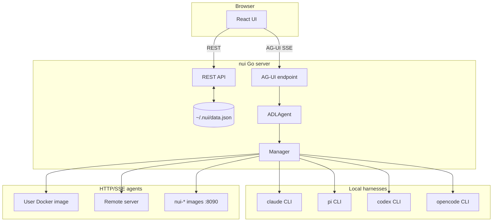

# nui — Product & Technical Specification

> **Status:** This document describes the product vision and the architecture **as implemented today**, with a roadmap for planned features. The Go code is the source of truth; sections marked *planned* are not yet enforced at runtime.

## Vision

nui is a self-hosted Go application with a bundled React web UI for creating and running AI agent sessions. Agent types are declared in ADL (Agent Definition Language); harnesses run as local subprocesses, Docker containers, or remote HTTP/SSE servers.

---

## Architecture (as built)



### Key design decisions

1. **Every session is an ADL agent.** Even the built-in CLI harnesses are compiled-in ADL definitions (`builtinAgentDefs` in `internal/agents/builtins.go`). Selecting "Claude Code" in the UI stores `agentType: "claude-code"` (the ADL `id`), which resolves to `harness.type: claude-code`. CLI flags such as `--agent-type` and `nui run -a` expect the ADL id (e.g. `claude-code`), not the display name. Built-in types also include five API harnesses (`anthropic`, `openai`, `gemini`, `openrouter`, `ollama`) and the `nui` master agent.

2. **Chat uses AG-UI, not raw SSE.** The UI (`useSessionChat.ts`) streams via `POST /api/sessions/:id/ag-ui` using the [AG-UI protocol](https://github.com/ag-ui-protocol/ag-ui). Tool calls, images, and MCP app frames are translated from agent `Event` types in `agui.go`. The legacy `POST /chat` endpoint still exists but the UI does not use it.

3. **Three production harness paths.**
   - **Go subprocess:** builtin harnesses (`claude-code`, `pi`, `codex`, `opencode`, `antigravity`) managed directly in Go.
   - **HTTP/SSE:** docker, devcontainer, remote, and builtin `sandbox: docker` via `HTTPExtensionAgent`.
   - **Extension harnesses:** installed extensions contribute harnesses wired via `Manager.getExtensionHarnessAgent()` — stdio (default), TCP (`ExtensionAgent`), or HTTP (`HTTPExtensionAgent`). ADL references them as `harness.type: ext:<extension>/<harness-id>`.
   - **Reference only:** standalone examples in `dev/harness-examples/py|ts/` (no `extension.yaml`) demonstrate the TCP JSON-RPC protocol but are not registered as agent types.

4. **Docker/remote via custom ADL.** There is no built-in "Docker" or "Remote" picker in the UI. Users copy an ADL template from `dev/harness-examples/` into `~/.nui/agents/` (e.g. `docker-echo.yaml`), then select it under **Installed agents**. nui validates the connector on session create.

5. **CLI launch + UI preferences.** `nui server -a <agent-id> --prompt --open` starts the HTTP server first, then creates a session via the same logic as `POST /api/launch` (shared with the warm-attach path when the server is already running). Use ADL ids for `-a` (e.g. `claude-code`). Session creation saves `lastAgentType` / `lastSessionId` to `state.json` and exposes the prompt once via `GET /api/bootstrap`. `nui server --open` (without `-a`) also creates a fresh session with the default agent. With `--open`, nui opens the browser to `/sessions/<id>` after the session is ready. If no sessions exist at startup and no launch flags were passed, nui auto-creates one with the default agent when the UI loads. Preferences (`defaultAgentType`, `defaultHarness`, theme, memory) live in `settings.json`; sidebar/recents/last session live in `state.json`.

6. **`nui` master agent (home launcher).** The home screen submits prompts to `POST /api/orchestrate`, which runs the built-in `nui` agent (legacy id `nui-orchestrator`). That agent uses the `nui-orchestrator` MCP tools (`list_agents`, `launch_session`) to open a specialist session, or the create-agent skill + `nui-agent` MCP to save a new ADL definition. Definition: `internal/agents/internal.go`.

---

## Agent Definition Language (ADL)

ADL design documentation and example YAML files live in this repository under [`dev/adl/`](adl/).

- [design.md](adl/design.md) — schema, semantics, harness types
- [examples/](adl/examples/) — sample agent and workflow YAML

In nui, place agent YAML in `~/.nui/agents/` to make them selectable under **Installed agents**. Sandbox config flows: ADL `harness.sandbox` → `harnessBuiltinConfig()` → `Manager.getBuiltinAgent()` → agent struct `Sandbox` field.

---

## Agent Runtime

### Go `Agent` interface

```go
type Agent interface {
    Name() string
    Run(ctx context.Context, req RunRequest, events chan<- Event) error
}
```

`ADLAgent` is the orchestrator. `Manager` caches one builtin agent per session ID **and harness type** and manages Docker container lifecycle (idle reaper at 30 min).

### HTTP/SSE harness protocol

Used by `docker`, `remote`, and builtin sandbox containers.

| Endpoint | Description |
|---|---|
| `GET /info` | `{"name","version","capabilities"}` — health check |
| `POST /run` | Body: `{message, sessionId?, workingDir?, systemPrompt?, model?}` → SSE |
| `POST /cancel` | Body: `{runId}` — cancel run best-effort |
| `POST /shutdown` | Stop subprocesses; nui calls this before `docker stop` |

SSE events (JSON in `data:` lines):

```
{"type":"text","content":"..."}
{"type":"done","sessionId":"..."}
{"type":"error","error":"..."}
```

Also supported: `tool_call_start`, `tool_call_args`, `tool_call_end`, `tool_call_result`, `image` (see `extension.go`).

Examples: `dev/harness-examples/docker/`, `dev/harness-examples/remote/`, `docker/http_nui_agent.py`.

### Extension harness protocol (stdio / TCP)

Used by installed extension harnesses (`ext:<extension>/<harness-id>`). See [extension-api.md](extension-api.md) and [harness-design.md](harness-design.md) §3.

| Method | Description |
|---|---|
| `harness.info` | Metadata |
| `harness.run` | Streams `harness.event` notifications |
| `harness.cancel` | Cancel run |
| `harness.shutdown` | Release resources |

Framework: `harness-sdk/nui_agent_stdio.py` (stdio), `harness-sdk/nui_agent.py` (TCP reference).

---

## UI / Backend

### Chat persistence

- UI messages (user + assistant text) saved to `~/.nui/data.json` → `sessionMessages` after each turn
- On session open: load `sessionMessages` if present, else fall back to agent history files
- Tool call bubbles and images are **not** persisted across restarts (AG-UI state is in-memory during the session)

### Reconnection

| Stream | Replay on disconnect? | Status |
|---|---|---|
| `GET /api/sessions/:id/runs/:runId/events` | Yes — `Last-Event-ID` replays from `~/.nui/runs/<runId>.jsonl` | Done |
| UI refresh during active headless run | Partial — `sessionChatStore.reconnectActiveRun()` re-attaches via runs API | Done |
| `POST /api/sessions/:id/ag-ui` (interactive chat) | No durable offset replay | *Planned* |

Headless runs persist events to JSONL and support SSE replay via the `Last-Event-ID` header (`runs_api.go`). The UI re-attaches to in-flight runs after page refresh by listing active runs and subscribing to their event streams.

Interactive AG-UI chat does not yet support mid-stream offset replay. A disconnect during an AG-UI turn loses the in-flight stream (persisted text messages survive via `sessionMessages`).

---

## Persistence

| Store | Format | Location | Status |
|---|---|---|---|
| Sessions + agent session IDs + UI messages | JSON | `~/.nui/data.json` | Done — rows removed on session delete |
| Settings (preferences) | JSON | `~/.nui/settings.json` | Done (`theme`, `uiTheme`, `defaultAgentType`, `defaultHarness`, `disabledExtensions`, memory modes). System base: `/etc/nui/settings.json` or `NUI_SYSTEM_CONFIG` (user wins) |
| UI state | JSON | `~/.nui/state.json` | Done (`lastAgentType`, `lastSessionId`, `recentSessionIds`, `recentAgents`, `sidebarOpen`, `sidebarWidth`, `recentsOpen`); `lastSessionId` cleared when that session is deleted |
| Secrets | JSON | `~/.nui/secrets.json` (0600) | Done — managed API credentials + free-form global env; Customize → Env vars. Merged with system secrets when present |
| Extension env | JSON | `~/.nui/extension-env.json` (0600) | Done — per-extension env maps; Customize → Extensions → Env. Merged with system extension-env when present |
| Data dir override | env | `NUI_DATA_DIR` | Writable user tree (default `~/.nui`) |
| Extra config dirs | env / flag | `NUI_EXTRA_CONFIG_DIRS` / `nui server --config-dir` | Supplemental read-only roots (`agents/`, `extensions/`); user data wins on conflicts |
| System config | env/dir | `NUI_SYSTEM_CONFIG` / `/etc/nui` | Read-only admin defaults (settings, secrets, extension-env, mcp-servers, agents, extensions) |
| Per-session harness config | dir | `~/.nui/sessions/<session-id>/` | Done — removed on session delete |
| Isolated workspaces | dir | `~/.nui/workspaces/<session-id>/` | Done — removed on session delete |
| Chat uploads | files | `$TMPDIR/nui-uploads/<session-id>/` | Done — removed on session delete |
| Run event log | JSONL | `~/.nui/runs/<runID>.jsonl` | Done — removed when owning session is deleted |
| HITL requests | JSON | `~/.nui/hitl-requests.json` | Done — session entries removed on session delete |
| Schedules | JSON | `~/.nui/schedules.json` | Done |
| Persistent memory | markdown | `~/.nui/memory/` | Done (not session-scoped) |
| ADL definitions | YAML | `~/.nui/agents/*.yaml` | Done |
| OpenCode Docker data | dir | `~/.nui/opencode-sessions/` | Shared mount for docker sandbox |
| Claude Code sessions | JSONL | `~/.claude/projects/<dirHash>/` | External — deleted with nui session when agent session id known |
| pi / codex / opencode sessions | varies | Harness-specific paths | External — deleted with nui session when agent session id known |

Example ADL templates for docker/remote harness walkthroughs: `dev/harness-examples/docker/docker-echo.yaml`, `dev/harness-examples/remote/remote-echo.yaml`, `dev/harness-examples/docker/opencode-docker.yaml`.

---

## API Surface

### Implemented

| Method | Path | Purpose |
|---|---|---|
| `GET/POST` | `/api/sessions` | List / create (docker/remote config validated on create; agents start on first message) |
| `POST` | `/api/sessions/ensure-default` | Return last session or create one with the default agent |
| `GET` | `/api/sessions/events` | Global session list SSE (`changed`) |
| `GET/PATCH/DELETE` | `/api/sessions/:id` | Get / rename / delete |
| `GET/PUT` | `/api/sessions/:id/messages` | Persisted UI messages |
| `POST/GET` | `/api/sessions/:id/uploads[/:file]` | File uploads for chat attachments |
| `GET` | `/api/sessions/:id/mentions` | @-mention autocomplete |
| `POST` | `/api/sessions/:id/ag-ui` | AG-UI chat stream |
| `POST` | `/api/sessions/:id/chat` | Legacy agent-event SSE |
| `POST` | `/api/sessions/:id/runs` | Start async headless run (`202` + `runId`) |
| `GET` | `/api/sessions/:id/runs` | List runs for session |
| `GET` | `/api/sessions/:id/runs/:runId` | Run status and output |
| `GET` | `/api/sessions/:id/runs/:runId/events` | SSE event stream with `Last-Event-ID` replay |
| `POST` | `/api/sessions/:id/runs/:runId/hitl` | Create HITL request scoped to run |
| `POST` | `/api/sessions/:id/stop` | Cancel in-flight run (`?runId=` optional) |
| `GET` | `/api/sessions/:id/history` | Agent-side history |
| `GET` | `/api/agent-types` | Builtin + ADL + extension agent types |
| `GET` | `/api/directories` | Working-dir suggestions |
| `GET/PUT` | `/api/settings` | Preferences (partial PUT; memory modes). Reads merge system+user; writes user layer only |
| `GET/PUT` | `/api/state` | UI restoration state (`lastSessionId`, recents, sidebar). User-only |
| `GET/PUT` | `/api/env` | Global env (`~/.nui/secrets.json`): managed credentials + custom key/values. PUT `{ "env": {…}, "custom": {…} }` (empty value clears; custom replaces all custom keys). `/api/credentials` is an alias. Merged with system secrets on read |
| `GET/PUT` | `/api/credentials` | Alias of `/api/env` (backward compatible). |
| `GET/PUT` | `/api/extensions/{name}/env` | Per-extension env (`~/.nui/extension-env.json`). PUT `{ "env": {…} }` replaces that extension’s **user** map. Reloads extension hosts. |
| `GET` | `/api/bootstrap` | One-shot CLI bootstrap (`sessionId`, `initialPrompt`) |
| `POST` | `/api/launch` | Create session + optional initial prompt |
| `POST` | `/api/orchestrate` | Home-launcher run via `nui` master agent |
| `GET` | `/api/orchestrator/routable-agents` | Agents eligible for `launch_session` |
| `GET` | `/api/capabilities` | Bwrap availability |
| `GET` | `/api/extensions` | Installed extensions |
| `POST` | `/api/extensions/reload` | Rescan extensions |
| `GET/PUT` | `/api/mcp-servers` | User MCP server config |
| `POST/GET/DELETE` | `/api/mcp-oauth/*` | Remote MCP OAuth flows (start, callback, flow, complete, status, redirect-uri, disconnect) |
| `GET/DELETE` | `/api/skills[/:name]` | Skill catalog |
| `GET` | `/api/memory` | Memory summary (user + agent files) |
| `GET/PUT` | `/api/memory/user` | User memory markdown |
| `GET/PUT/DELETE` | `/api/memory/agents/:id` | Per-agent memory markdown |
| `GET/POST/PUT/DELETE` | `/api/agents[/:file]` | User ADL agent CRUD |
| `POST` | `/api/agents/:id/deploy` | Deploy agent via extension deployer |
| `GET` | `/api/agent-deployers` | List deployers |
| `GET/POST/PATCH/DELETE` | `/api/schedules[/:id]` | Schedule CRUD |
| `POST` | `/api/schedules/:id/run-now` | Trigger schedule immediately |
| `POST/GET` | `/api/hitl/requests[/:id]` | HITL request CRUD + wait/respond |
| `GET` | `/api/hitl-channels` | Available HITL delivery channels |
| `POST/GET` | `/mcp-call-tool`, `/mcp-resource` | MCP proxy for UI tool frames |

### Planned

| Method | Path | Purpose |
|---|---|---|
| _(none)_ | | Headless runs API implemented — see Implemented table |

---

## Implementation Phases

### Phase 1 — Interactive chat ✅
- [x] Five builtin CLI harnesses (claude-code, pi, codex, opencode, antigravity)
- [x] Five builtin API harnesses (anthropic, openai, gemini, openrouter, ollama)
- [x] Session CRUD + persistence (`data.json` including UI messages)
- [x] AG-UI chat streaming with tool calls and images
- [x] HTTP/SSE docker + remote connectors
- [x] Builtin sandbox Docker images (`docker/`, port 8090)
- [x] CLI session launch (`nui server --agent-type --prompt --working-dir`)
- [x] UI preferences (`defaultAgentType`, `defaultHarness`, `lastAgentType`, `lastSessionId`, `sidebarOpen`)
- [x] Bubblewrap sandbox for all four CLI harnesses (Linux)
- [x] User ADL in `~/.nui/agents/*.yaml`
- [x] Docker/remote reachability check on session create

### Phase 2 — ADL workflows ✅
- [x] ADL YAML schema + parser
- [x] Multi-step DAG (`dependsOn`, topo sort)
- [x] Named outputs / inputs between steps
- [x] Per-step harness override + sandbox propagation
- [x] Durable run log + SSE reconnection

### Phase 3 — External integrations
- [x] ADL `skill` references (SKILL.md) → session harness config
- [x] ADL `aiAssets.skills` (path, ref, content, git+path) → catalog + session harness config
- [x] `nui skills add|list|remove` CLI
- [x] `nui memory list|show|edit` CLI
- [x] Persistent memory (`~/.nui/memory/`) with UI toggles and agent write path
- [x] `nui extension add|list|remove|create` CLI
- [x] `nui env list|get|set|unset` and `nui extension env` CLI
- [x] Overwrite confirmation (`-y`) on `agent add`, `extension add`, `skills add`, `extension create`
- [x] ADL `aiAssets.mcpServers` → session harness config
- [x] Remote MCP OAuth in Settings (`/api/mcp-oauth/*`)

### Phase 4 — Scheduled runs ✅
- [x] Interval schedules align to clock boundaries (e.g. `5m` at :00, :05, :10… UTC), not current time + interval
- [x] Server scheduler: each tick creates a new session + headless run
- [x] Only `promptMode: auto` ADL agents are schedulable
- [x] REST API + `nui schedule` CLI
- [x] Customize → Schedules UI
- [x] Session sidebar: scheduled indicator + relative last-run time

### Phase 5 — Master agent / launcher ✅
- [x] Built-in `nui` master agent (legacy id `nui-orchestrator`)
- [x] `nui orchestrator-mcp` (`list_agents`, `launch_session`)
- [x] Home launcher via `POST /api/orchestrate`
- [x] Create-agent skill on the launcher path

---

## Open Questions

1. **AG-UI chat replay** — add offset-based durable replay for interactive chat streams?
2. **Chat persistence scope** — persist tool calls/images in `sessionMessages` or separate store?
3. **Docker security** — gVisor/Firecracker for untrusted agents?

See also: [harness-design.md](harness-design.md), [ADL design](adl/design.md), [ADL examples](adl/examples/), [harness-examples/](harness-examples/).
