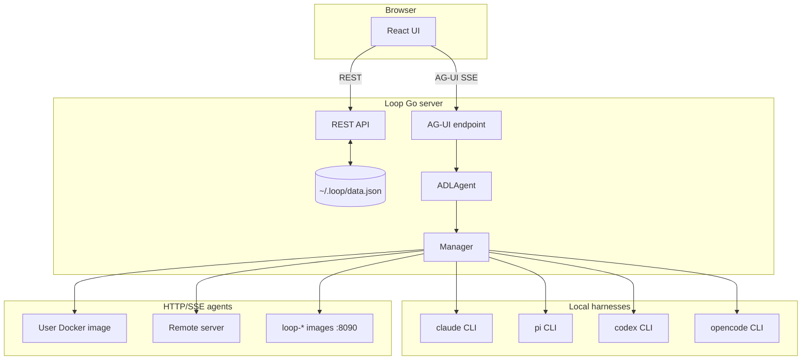

# The Loop — Product & Technical Specification

> **Status:** This document describes the product vision and the architecture **as implemented today**, with a roadmap for planned features. The Go code is the source of truth; sections marked *planned* are not yet enforced at runtime.

## Vision

The Loop is a self-hosted Go application with a bundled React web UI for creating and running AI agent sessions. It supports interactive chat today, with semi-autonomous (HITL) and fully autonomous modes on the roadmap. Agent types are declared in ADL (Agent Definition Language); harnesses run as local subprocesses, Docker containers, or remote HTTP/SSE servers.

---

## Architecture (as built)



### Key design decisions

1. **Every session is an ADL agent.** Even the four built-in CLI harnesses are compiled-in ADL definitions (`builtinAgentDefs` in `api.go`). Selecting "Claude Code" in the UI stores `agentType: "Claude Code"`, which resolves to `harness.type: claude-code`.

2. **Chat uses AG-UI, not raw SSE.** The UI (`useSessionChat.ts`) streams via `POST /api/sessions/:id/ag-ui` using the [AG-UI protocol](https://github.com/ag-ui-protocol/ag-ui). Tool calls, images, and MCP app frames are translated from agent `Event` types in `agui.go`. The legacy `POST /chat` endpoint still exists but the UI does not use it.

3. **Two extension transports.**
   - **Production path:** builtin harnesses are Go structs that manage CLI subprocesses; docker/remote use `HTTPExtensionAgent`.
   - **Reference path:** TCP JSON-RPC 2.0 in `dev/extension-examples/py|ts/` and `ExtensionAgent` in Go — implemented but **not wired** to `Manager.GetAgent()`. For third-party custom agents.

4. **Docker/remote via custom ADL.** There is no built-in "Docker" or "Remote" picker in the UI. Users select a custom ADL agent (e.g. `docker-echo` from `~/.loop/agents/docker-echo.yaml`). Loop validates the connector on session create.

5. **CLI launch + UI preferences.** `loop ui --agent-type --prompt --open` creates a session at server start (`bootstrap.go`), saves `lastAgentType` / `lastSessionId` to `settings.json`, and exposes the prompt once via `GET /api/bootstrap`. `loop ui --open` (without `--agent-type`) also creates a fresh blank session and selects it via bootstrap instead of resuming `lastSessionId`. With `--open`, Loop waits for `/health` then launches the UI in the system default browser. If no sessions exist at startup, Loop auto-creates one with the default agent. Sidebar state and last-selected session/agent are also persisted in `settings.json`.

---

## Project Modes

| Mode | Description | Status |
|---|---|---|
| **Interactive** | Back-and-forth chat session | **Implemented** |
| **Semi-autonomous** | Agent pauses at approval gates | *Planned* (ADL fields exist, not enforced) |
| **Autonomous** | Runs on schedule or event trigger | *Planned* |

---

## Agent Definition Language (ADL)

ADL is a YAML format for declaring an agent type or multi-step workflow. It is a **static definition** — it describes *what* an agent is, not *how* Loop executes it internally.

### Three-layer architecture

- **ADL** — agent identity, steps, harness, schedule (*this layer*)
- **MCP** — runtime tool protocol; MCP tool UI works for Claude tool events, but ADL `tools.mcp` is not yet wired
- **SKILL.md** — agent persona file (*planned* reference support)

### Schema

```yaml
adl: "1.0"

name: string
description: string
version: semver
kind: agent | workflow          # workflow = multi-step; omitted defaults to agent

harness:
  type: claude-code | pi | codex | opencode | docker | remote
  model: string
  workingDir: string              # optional; defaults to server CWD
  sandbox: none | bubblewrap | docker   # subprocess harnesses only; default: none
  image: string                   # sandbox:docker or harness.type:docker
  containerPort: 9090             # harness.type:docker (user images; builtin sandbox images use 8090)
  host: string                    # harness.type:remote
  port: 9090                      # harness.type:remote

systemPrompt: |
  You are ...

schedule:                         # *planned — not enforced*
  cron: "0 9 * * 1-5"
  timezone: America/Los_Angeles

tools:                            # *planned — not enforced*
  mcp:
    - url: "http://localhost:3001"
      name: filesystem

steps:                            # omit for single-step agents
  - name: research
    policy: react                 # *parsed, not enforced — all steps run sequentially*
    harness:                      # optional per-step override
      type: claude-code
      model: claude-opus-4-8
    dependsOn: []
    outputs:
      - name: report
        type: text
    inputs:
      - from: other.report
        as: alias
    approval: none                # *planned*
    approvalTimeout: "30m"

constraints:                      # *parsed, not enforced*
  maxTokens: 100000
  timeout: "30m"
  retries: 3
  maxConcurrency: 4
```

### Harness types (implemented)

| Harness | Local (`sandbox: none`) | Bubblewrap (`sandbox: bubblewrap`) | Docker (`sandbox: docker`) |
|---|---|---|---|
| `claude-code` | `ClaudeCodeAgent` → `claude` CLI | bwrap + `~/.claude` | `loop-claude-code:latest` :8090 |
| `pi` | `PiAgent` → `pi --mode rpc` | bwrap + `~/.pi` | `loop-pi:latest` :8090 |
| `codex` | `CodexAgent` → `codex exec` | bwrap + `~/.codex` | `loop-codex:latest` :8090 |
| `opencode` | `OpenCodeAgent` → `opencode serve/run` | bwrap + `~/.local/share/opencode` | `loop-opencode:latest` :8090 |
| `docker` | — | — | User image at ADL `containerPort` (e.g. 9090) |
| `remote` | — | — | User `host:port` over HTTP/SSE |

Sandbox config flows: ADL `harness.sandbox` → `harnessBuiltinConfig()` → `Manager.getBuiltinAgent()` → agent struct `Sandbox` field.

### ADL executor (implemented vs planned)

| Feature | Status |
|---|---|
| YAML parse into `ADLDefinition` | Done |
| Topological sort (`dependsOn`) | Done |
| Per-step harness/model/systemPrompt | Done |
| Named outputs → downstream inputs | Done |
| All six harness types + sandbox | Done |
| Step `policy` (parallel/loop/batch) | Parsed only |
| `approval` / `approvalTimeout` | Parsed only |
| `constraints` | Parsed only |
| `schedule.cron` | Parsed only |
| `tools.mcp` | Parsed only |

---

## Agent Runtime

### Go `Agent` interface

```go
type Agent interface {
    Name() string
    Run(ctx context.Context, req RunRequest, events chan<- Event) error
}
```

`ADLAgent` is the orchestrator. `Manager` caches one builtin agent per session ID and manages Docker container lifecycle (idle reaper at 30 min).

### HTTP/SSE extension protocol

Used by `docker`, `remote`, and builtin sandbox containers.

| Endpoint | Description |
|---|---|
| `GET /info` | `{"name","version","capabilities"}` — health check |
| `POST /run` | Body: `{message, sessionId?, workingDir?, systemPrompt?, model?}` → SSE |
| `POST /cancel` | Body: `{runId}` — cancel run best-effort |
| `POST /shutdown` | Stop subprocesses; Loop calls this before `docker stop` |

SSE events (JSON in `data:` lines):

```
{"type":"text","content":"..."}
{"type":"done","sessionId":"..."}
{"type":"error","error":"..."}
```

Also supported: `tool_call_start`, `tool_call_args`, `tool_call_end`, `tool_call_result`, `image` (see `extension.go`).

Examples: `dev/extension-examples/docker/`, `dev/extension-examples/remote/`, `docker/http_loop_agent.py`.

### TCP JSON-RPC protocol (reference only)

For custom extension authors. Not connected to `Manager` today.

| Method | Description |
|---|---|
| `harness.info` | Metadata |
| `harness.run` | Streams `harness.event` notifications |
| `harness.cancel` | Cancel run |
| `harness.shutdown` | Release resources |

Framework: `extensions/loop_agent.py`, `dev/extension-examples/py/loop_agent.py`.

---

## UI / Backend

### Chat persistence

- UI messages (user + assistant text) saved to `~/.loop/data.json` → `sessionMessages` after each turn
- On session open: load `sessionMessages` if present, else fall back to agent history files
- Tool call bubbles and images are **not** persisted across restarts (AG-UI state is in-memory during the session)

### Reconnection (*planned*)

Offset-based durable stream with `Last-Event-ID` replay is designed but not implemented. A disconnect mid-run currently loses the in-flight stream.

---

## Human-in-the-Loop (*planned*)

When `approval: required` is enforced, the executor will pause, emit an approval event, and wait for `POST /api/sessions/:id/approve`. Deny-on-timeout (`approvalTimeout`) is the intended default.

---

## Persistence

| Store | Format | Location | Status |
|---|---|---|---|
| Sessions + agent session IDs + UI messages | JSON | `~/.loop/data.json` | Done |
| Settings | JSON | `~/.loop/settings.json` | Done (`theme`, `lastAgentType`, `lastSessionId`, `sidebarOpen`) |
| ADL definitions | YAML | `~/.loop/agents/*.yaml` | Done |
| Default ADL templates | YAML | Auto-provisioned on startup | Done |
| Run event log | JSONL | `~/.loop/runs/<runID>.jsonl` | Planned |
| Claude Code sessions | JSONL | `~/.claude/projects/<dirHash>/` | External |
| pi / codex / opencode sessions | varies | Harness-specific paths | External |

Default provisioned agents: `opencode-docker.yaml`, `docker-echo.yaml`, `remote-echo.yaml`.

---

## API Surface

### Implemented

| Method | Path | Purpose |
|---|---|---|
| `GET/POST` | `/api/sessions` | List / create (docker/remote config validated on create; agents start on first message) |
| `GET/PATCH/DELETE` | `/api/sessions/:id` | Get / rename / delete |
| `GET/PUT` | `/api/sessions/:id/messages` | Persisted UI messages |
| `POST` | `/api/sessions/:id/ag-ui` | AG-UI chat stream |
| `POST` | `/api/sessions/:id/chat` | Legacy agent-event SSE |
| `GET` | `/api/sessions/:id/history` | Agent-side history |
| `GET` | `/api/agent-types` | Builtin + ADL agent types |
| `GET` | `/api/directories` | Working-dir suggestions |
| `GET/PUT` | `/api/settings` | User preferences (partial PUT) |
| `GET` | `/api/bootstrap` | One-shot CLI bootstrap (`sessionId`, `initialPrompt`) |
| `GET` | `/api/capabilities` | Bwrap availability |

### Planned

| Method | Path | Purpose |
|---|---|---|
| `POST` | `/api/sessions/:id/approve` | HITL approval response |
| `POST` | `/api/events/:name` | Trigger autonomous agents |
| `GET` | `/api/sessions/:id/runs` | Run history |

---

## Implementation Phases

### Phase 1 — Interactive chat ✅
- [x] Four builtin CLI harnesses (claude-code, pi, codex, opencode)
- [x] Session CRUD + persistence (`data.json` including UI messages)
- [x] AG-UI chat streaming with tool calls and images
- [x] HTTP/SSE docker + remote connectors
- [x] Builtin sandbox Docker images (`docker/`, port 8090)
- [x] CLI session launch (`loop ui --agent-type --prompt --working-dir`)
- [x] UI preferences (`lastAgentType`, `lastSessionId`, `sidebarOpen`)
- [x] Bubblewrap sandbox for all four CLI harnesses (Linux)
- [x] User ADL in `~/.loop/agents/*.yaml`
- [x] Default ADL templates (docker-echo, remote-echo, opencode-docker)
- [x] Docker/remote reachability check on session create

### Phase 2 — ADL workflows (partial)
- [x] ADL YAML schema + parser
- [x] Multi-step DAG (`dependsOn`, topo sort)
- [x] Named outputs / inputs between steps
- [x] Per-step harness override + sandbox propagation
- [ ] HITL approval gates
- [ ] Step execution policies (parallel, loop, batch)
- [ ] Constraints enforcement (timeout, maxTokens)
- [ ] Durable run log + SSE reconnection

### Phase 3 — Autonomous (*planned*)
- [ ] Cron + event triggers
- [ ] `loop` and `batch` policies

### Phase 4 — External integrations (*planned*)
- [ ] Slack/webhook HITL channels
- [ ] ADL skill references (SKILL.md)
- [ ] ADL MCP server configuration

---

## Open Questions

1. **Wire TCP JSON-RPC extensions?** `ExtensionAgent` exists but is unused — adopt for a `custom` harness type, or remove?
2. **ADL policy enforcement order** — policies before or after HITL?
3. **Chat persistence scope** — persist tool calls/images in `sessionMessages` or separate store?
4. **Docker security** — gVisor/Firecracker for untrusted agents?

See also: [extension-design.md](extension-design.md), [adl/examples/README.md](adl/examples/README.md), [extension-examples/](extension-examples/).
