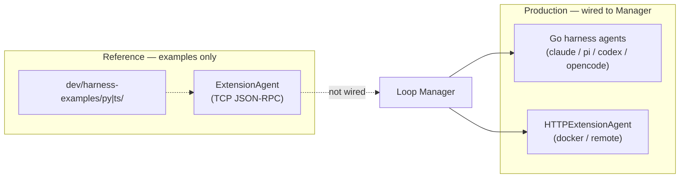

# Harness Protocols for Loop

> **Source of truth:** the Go code in `internal/agent/` and the runnable examples in `dev/harness-examples/`.

Loop uses **two custom harness transports**, depending on how the agent runs:



## 1. Builtin harnesses (Go subprocess) — primary path

The four built-in CLI agents are **not** Python/TypeScript harnesses. Go structs in `internal/agent/` manage CLI subprocesses directly:

| Harness | Implementation |
|---|---|
| `claude-code` | `ClaudeCodeAgent` + `persistentClaudeSession` |
| `pi` | `PiAgent` + `persistentPiSession` (`pi --mode rpc`) |
| `codex` | `CodexAgent` + `persistentCodexSession` |
| `opencode` | `OpenCodeAgent` + `persistentOpenCodeSession` |

Sandbox (`harness.sandbox` in ADL) is propagated via `builtin_config.go` → `Manager.getBuiltinAgent()`.

For `sandbox: docker`, builtin harnesses use HTTP/SSE inside Loop-managed containers (`docker/` images, port **8090**).

## 2. HTTP/SSE — docker and remote harnesses

Used for:
- ADL agents with `harness.type: docker` or `remote`
- Builtin `sandbox: docker` (via `HTTPExtensionAgent` talking to `loop-*` images)

### Endpoints

| Endpoint | Description |
|---|---|
| `GET /info` | Health check; returns `{name, version, capabilities}` |
| `POST /run` | Body: `{message, sessionId?, workingDir?, systemPrompt?, model?}` → `text/event-stream` |
| `POST /cancel` | Body: `{runId}` — cancel current run |
| `POST /shutdown` | Release subprocess resources; Loop calls before `docker stop` |

### SSE events

```json
{"type": "text", "content": "..."}
{"type": "done", "sessionId": "..."}
{"type": "error", "error": "..."}
```

Extended types (tool calls, images) are supported by the Go client in `extension.go`.

### Implementations

| Location | Port | Notes |
|---|---|---|
| `docker/http_loop_agent.py` | 8090 | Builtin sandbox images (`loop-claude-code`, etc.) |
| `dev/harness-examples/docker/` | 9090 | User custom harnesses; ADL `containerPort` |
| `dev/harness-examples/remote/` | user-defined | Standalone server, no lifecycle management |

### Lifecycle

| Event | Docker | Remote |
|---|---|---|
| Session create | `docker run` + `GET /info` health check | `GET /info` reachability check |
| Chat message | `POST /run` → SSE | `POST /run` → SSE |
| Session delete | `POST /shutdown` + `docker stop` | Nothing |
| Server shutdown | Stop all managed containers | Nothing |

See [docker/instructions.md](harness-examples/docker/instructions.md) and [remote/instructions.md](harness-examples/remote/instructions.md).

## 3. TCP JSON-RPC — reference for custom harness authors

`ExtensionAgent` in `internal/agent/extension.go` implements a TCP JSON-RPC 2.0 **client**, but `Manager.GetAgent()` does **not** launch or connect to TCP harnesses today. The protocol and frameworks exist for third-party agents and future wiring.

### Connection file

Harness processes write `~/.loop/extensions/<name>.json`:

```json
{"host": "127.0.0.1", "port": 52341, "session_id": "...", "pid": 9876}
```

### Methods

| Method | Description |
|---|---|
| `harness.info` | Returns name, version, capabilities |
| `harness.run` | Params: `{message, runId, sessionId?, workingDir?, systemPrompt?, model?}`; streams `harness.event` notifications |
| `harness.cancel` | Params: `{runId}` |
| `harness.shutdown` | Release resources |

### Frameworks

| Language | Framework | Example |
|---|---|---|
| Python | `extensions/loop_agent.py` (canonical) | `dev/harness-examples/py/echo_agent.py` |
| TypeScript | `dev/harness-examples/ts/loop_agent.ts` | `dev/harness-examples/ts/echo_agent.ts` |

Test with `dev/harness-examples/py/client.py` or `ts/client.ts`.

## Historical note

The research below evaluated JSON-RPC over stdio/TCP, go-plugin, ZeroMQ, and MCP as harness transports. The production implementation chose:

- **Go-native subprocess management** for builtin CLI harnesses (simpler, no IPC overhead)
- **HTTP/SSE** for docker/remote (proxy-friendly, standard tooling)
- **TCP JSON-RPC kept as reference** for custom harness authors

---

## Prior Art (research)

| System | Transport | Reconnect mechanism |
|---|---|---|
| **Jupyter** | ZeroMQ (5 sockets) | Connection file with port + session ID |
| **LSP / DAP** | stdio JSON-RPC 2.0 | Process restart (no reconnect needed) |
| **hashicorp/go-plugin** | gRPC over local TCP | `ReattachConfig{Protocol, Addr, Pid}` |

### Why not ZeroMQ?
ZeroMQ requires native bindings (`pyzmq`, `zeromq.js`) — significant install friction. Plain TCP + connection file achieves the same reconnect pattern.

### Why not go-plugin?
go-plugin is Go-centric; cross-language gRPC boilerplate is non-trivial for harness authors.

### The MCP question
MCP uses JSON-RPC 2.0 over stdio or SSE with official SDKs. Loop already surfaces MCP tool UI for Claude tool events via AG-UI. Full MCP-as-harness-protocol remains an open question.

---

## Open Questions

1. **Wire TCP harnesses into Manager?** Add a `custom` harness type that launches `extensions/*.py`?
2. **Crash policy:** respawn on connection loss or surface error to user?
3. **MCP as wire protocol?** Reduces custom protocol surface but binds to evolving external spec.

[Harness Examples](harness-examples)
