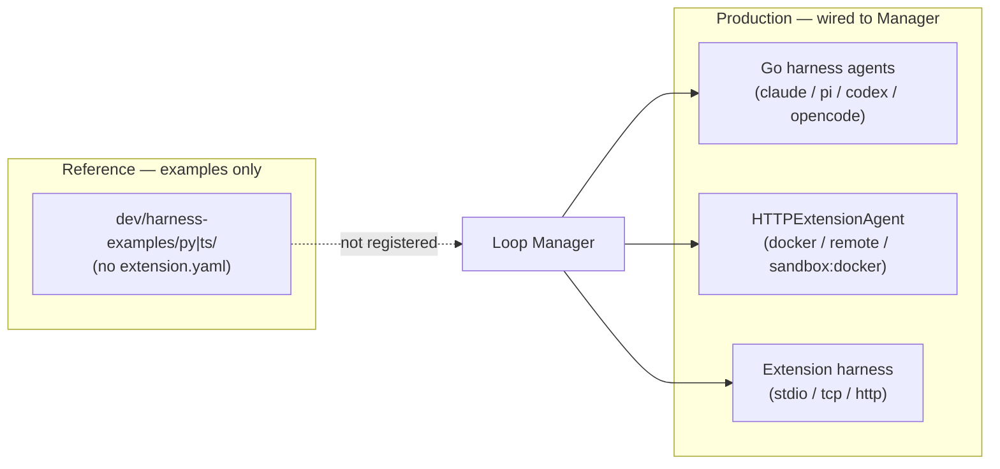

# Harness Protocols for Loop

> **Source of truth:** the Go code in `internal/agent/` and the runnable examples in `dev/harness-examples/`.

Loop uses **three production harness paths** plus standalone reference examples:



## 1. Builtin harnesses (Go subprocess) — primary path

The four built-in CLI agents are **not** Python/TypeScript harnesses. Go structs in `internal/agent/` manage CLI subprocesses directly:

| Harness | Implementation |
|---|---|
| `claude-code` | `ClaudeCodeAgent` + `persistentClaudeSession` |
| `pi` | `PiAgent` + `persistentPiSession` (`pi --mode rpc`) |
| `codex` | `CodexAgent` + `persistentCodexSession` |
| `opencode` | `OpenCodeAgent` + `persistentOpenCodeSession` |

Sandbox (`harness.sandbox` in ADL) is propagated via `builtin_config.go` → `Manager.getBuiltinAgent()`.

For `sandbox: docker`, builtin harnesses use HTTP/SSE inside Loop-managed containers (`docker/` images, port **8090**).

## 2. HTTP/SSE — docker and remote harnesses

Used by:
- ADL agents with `harness.type: docker`, `devcontainer`, or `remote`
- Builtin `sandbox: docker` (via `HTTPExtensionAgent` talking to `loop-*` images)

### Endpoints

| Endpoint | Description |
|---|---|
| `GET /info` | Health check; returns `{name, version, capabilities}` |
| `POST /run` | Body: `{message, sessionId?, workingDir?, systemPrompt?, model?}` → `text/event-stream` |
| `POST /cancel` | Body: `{runId}` — cancel current run |
| `POST /shutdown` | Release subprocess resources; Loop calls before `docker stop` |

### SSE events

```json
{"type": "text", "content": "..."}
{"type": "done", "sessionId": "..."}
{"type": "error", "error": "..."}
```

Extended types (tool calls, images) are supported by the Go client in `extension.go`.

### Implementations

| Location | Port | Notes |
|---|---|---|
| `docker/http_loop_agent.py` | 8090 | Builtin sandbox images (`loop-claude-code`, etc.) |
| `dev/harness-examples/docker/` | 9090 | User custom harnesses; ADL `containerPort` |
| `dev/harness-examples/remote/` | user-defined | Standalone server, no lifecycle management |

### Lifecycle

| Event | Docker | Remote |
|---|---|---|
| Session create | `docker run` + `GET /info` health check | `GET /info` reachability check |
| Chat message | `POST /run` → SSE | `POST /run` → SSE |
| Session delete | `POST /shutdown` + `docker stop` | Nothing |
| Server shutdown | Stop all managed containers | Nothing |

See [docker/instructions.md](harness-examples/docker/instructions.md), [devcontainer/instructions.md](harness-examples/devcontainer/instructions.md), and [remote/instructions.md](harness-examples/remote/instructions.md).

## 2b. Devcontainer harness (Loop-managed sandbox)

`harness.type: devcontainer` runs a builtin CLI (`innerHarness`) inside a **Loop-provisioned** dev container. Users do not author `devcontainer.json` — Loop writes it to `~/.loop/sessions/<session-id>/.devcontainer/` and runs `devcontainer up` + `devcontainer exec`.

| Concern | Behavior |
|---------|----------|
| Config | Loop-generated per session (not user project) |
| Inner CLI | ADL `innerHarness`: `claude-code` \| `pi` \| `codex` \| `opencode` |
| Image | Default `loop-devcontainer-<harness>:latest` (auto-built on first use) or ADL `image` override |
| API keys | `${localEnv:...}` in generated `remoteEnv` |
| Lifecycle | `devcontainer up` → `devcontainer exec` → `docker stop` on delete |
| Prerequisite | `devcontainer` CLI on PATH + Docker |

Example: [`dev/harness-examples/devcontainer/`](harness-examples/devcontainer/).

## 3. Extension harnesses (stdio / TCP / HTTP) — production path

Installed extensions contribute harnesses under `contributions.harnesses`. ADL agents reference them as `harness.type: ext:<extension>/<harness-id>`. `Manager.getExtensionHarnessAgent()` in `manager.go` launches and connects to them:

| Transport | Go client | Runtime |
|---|---|---|
| `stdio` (default) | `stdioHarnessAgent` | Loop spawns the extension host process |
| `tcp` | `ExtensionAgent` | Host writes `~/.loop/connections/<id>.json`; Loop dials JSON-RPC 2.0 |
| `http` | `HTTPExtensionAgent` | Same HTTP/SSE protocol as docker/remote |

Wire protocol methods (stdio and TCP):

| Method | Description |
|---|---|
| `harness.info` | Returns name, version, capabilities |
| `harness.run` | Params: `{message, runId, sessionId?, workingDir?, systemPrompt?, model?}`; streams `harness.event` notifications |
| `harness.cancel` | Params: `{runId}` |
| `harness.shutdown` | Release resources |

Framework: [`harness-sdk/loop_agent_stdio.py`](../harness-sdk/loop_agent_stdio.py). Example extension: [`dev/extension-examples/corp-pack/`](../dev/extension-examples/corp-pack/).

### TCP connection file

TCP and HTTP extension hosts write `~/.loop/connections/<id>.json`:

```json
{"host": "127.0.0.1", "port": 52341, "session_id": "...", "pid": 9876}
```

## 4. API harness (in-process)

Builtin and ADL agents with `harness.type: api` run entirely inside the Loop binary via [mozilla-ai/any-llm-go](https://github.com/mozilla-ai/any-llm-go). No CLI subprocess is required.

| Builtin ID | Provider | Credentials |
|---|---|---|
| `anthropic` | Anthropic | `ANTHROPIC_API_KEY` (+ optional `ANTHROPIC_BASE_URL`, `ANTHROPIC_MODEL`) |
| `openai` | OpenAI | `OPENAI_API_KEY` (+ optional `OPENAI_BASE_URL`, `OPENAI_MODEL`) |
| `gemini` | Gemini | `GEMINI_API_KEY` or `GOOGLE_API_KEY` |
| `openrouter` | OpenAI-compatible + OpenRouter base URL | `OPENROUTER_API_KEY` |
| `ollama` | Ollama (local) | none (`OLLAMA_HOST` optional; model auto-picked from installed models, or set `OLLAMA_MODEL`) |

ADL example:

```yaml
harness:
  type: api
  provider: anthropic
  model: claude-sonnet-4-20250514
```

Tool calling uses session-scoped MCP servers from ADL `aiAssets.mcpServers` (including extension custom tools). Loop implements the agentic tool loop and emits the same `agent.Event` tool-call events as CLI harnesses.

## 5. Standalone reference examples (not wired)

The folders [`dev/harness-examples/py/`](harness-examples/py/) and [`dev/harness-examples/ts/`](harness-examples/ts/) demonstrate the TCP JSON-RPC protocol and SDK without an `extension.yaml`. They are **not** registered with Loop's extension system and are not selectable as agent types. Use them to learn the wire protocol; ship production harnesses as installed extensions.

| Language | Framework | Example |
|---|---|---|
| Python | `harness-sdk/loop_agent.py` | `dev/harness-examples/py/echo_agent.py` |
| TypeScript | `dev/harness-examples/ts/loop_agent.ts` | `dev/harness-examples/ts/echo_agent.ts` |

Test with `dev/harness-examples/py/client.py` or `ts/client.ts`.

## Historical note

The research below evaluated JSON-RPC over stdio/TCP, go-plugin, ZeroMQ, and MCP as harness transports. The production implementation chose:

- **Go-native subprocess management** for builtin CLI harnesses (simpler, no IPC overhead)
- **HTTP/SSE** for docker/remote and extension HTTP harnesses (proxy-friendly, standard tooling)
- **JSON-RPC over stdio/TCP** for installed extension harnesses (`getExtensionHarnessAgent`)
- **Standalone py/ts examples** kept as reference for authors learning the wire protocol

---

## Prior Art (research)

| System | Transport | Reconnect mechanism |
|---|---|---|
| **Jupyter** | ZeroMQ (5 sockets) | Connection file with port + session ID |
| **LSP / DAP** | stdio JSON-RPC 2.0 | Process restart (no reconnect needed) |
| **hashicorp/go-plugin** | gRPC over local TCP | `ReattachConfig{Protocol, Addr, Pid}` |

### Why not ZeroMQ?
ZeroMQ requires native bindings (`pyzmq`, `zeromq.js`) — significant install friction. Plain TCP + connection file achieves the same reconnect pattern.

### Why not go-plugin?
go-plugin is Go-centric; cross-language gRPC boilerplate is non-trivial for harness authors.

### The MCP question
MCP uses JSON-RPC 2.0 over stdio or SSE with official SDKs. Loop already surfaces MCP tool UI for Claude tool events via AG-UI. Full MCP-as-harness-protocol remains an open question.

---

## Open Questions

1. **Crash policy:** respawn extension harness on connection loss or surface error to user?
2. **MCP as wire protocol?** Reduces custom protocol surface but binds to evolving external spec.

[Harness Examples](harness-examples)
