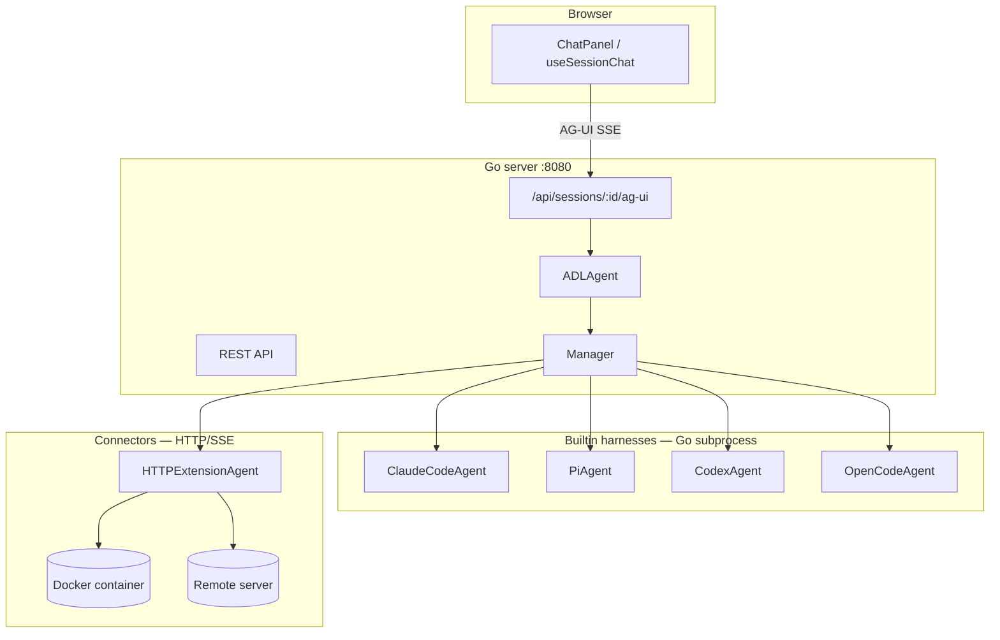

## Prerequisites

- Go 1.26+
- Node.js 18+
- Agent CLIs on `PATH` as needed: `claude`, `pi`, `codex`, `opencode`
- Docker (optional) — for `sandbox: docker`, custom docker-harness ADL agents, and devcontainer harnesses
- Dev Container CLI (optional) — for `harness.type: devcontainer` (`npm install -g @devcontainers/cli`)

## Project structure

```
nui/
├── main.go, embed.go          # entrypoint; embeds ui/dist
├── cmd/                       # cobra CLI (nui server, extension, skills, …)
├── internal/
│   ├── model/                 # Session, ChatMessage, ADL structs
│   ├── agent/                 # Agent interface, harness implementations, ADL executor
│   ├── server/                # HTTP mux, REST + AG-UI streaming
│   ├── store/                 # JSON persistence (~/.nui/)
│   └── extensions/            # Extension registry, install, RPC
├── docker/                    # Builtin sandbox images (HTTP/SSE, port 8090)
├── harness-sdk/               # Python extension author SDK
├── sdk/                       # Programmatic extension SDKs (Python, TS, Go)
├── dev/                       # Specs, examples, extension-api.md
└── ui/                        # Vite + React frontend
```

## Running in development

Terminal 1 — Vite dev server (proxies `/api` to Go):

```bash
cd ui && npm install && npm run dev
```

Terminal 2 — Go server (`ui/dist` must exist before `go build`):

```bash
cd ui && npm run build && cd ..
go run . server              # default :8080
go run . server --port 3000  # custom port
```

Production build:

```bash
cd ui && npm run build && cd .. && go build -o nui_bin . && ./nui_bin server
```

## Architecture



**Session flow:** every session has an `agentType` that resolves to an ADL definition (built-in or `~/.nui/agents/*.yaml`). `ADLAgent` runs the harness — single-step for simple agents, multi-step DAG for workflows. The UI streams chat over the [AG-UI protocol](https://github.com/ag-ui-protocol/ag-ui) at `POST /api/sessions/:id/ag-ui`. The home launcher uses `POST /api/orchestrate` with the built-in `nui` master agent.

## REST API (selected)

| Endpoint | Description |
|----------|-------------|
| `GET/POST /api/sessions` | List / create sessions |
| `POST /api/sessions/ensure-default` | Return last session or create with default agent |
| `GET/PATCH/DELETE /api/sessions/:id` | Get / rename / delete |
| `GET/PUT /api/sessions/:id/messages` | Persisted UI messages |
| `POST /api/sessions/:id/ag-ui` | **Primary chat endpoint** (AG-UI protocol) |
| `POST /api/orchestrate` | Home-launcher orchestration (`nui` master agent) |
| `GET /api/orchestrator/routable-agents` | Agents eligible for launcher delegation |
| `GET /api/agent-types` | Builtin + user + extension ADL types |
| `GET/PUT /api/settings` | User preferences |
| `GET /api/extensions` | Installed extensions and contribution ids |
| `POST /api/extensions/reload` | Rescan `~/.nui/extensions/` |
| `GET /api/memory` | Memory summary |
| `GET/PUT /api/mcp-servers` | User MCP server config |
| `POST/GET/DELETE /api/mcp-oauth/*` | Remote MCP OAuth flows |
| `GET /api/hitl-channels` | HITL delivery channels |
| `POST /api/hitl/requests` | Create HITL request |
| `GET /api/capabilities` | bwrap availability |

Full tables live in [DEVELOPERS.md](https://github.com/plmbr/nui/blob/main/DEVELOPERS.md) and [dev/dev.md](https://github.com/plmbr/nui/blob/main/dev/dev.md) on `main`. See [Extension REST API]({{ '/docs/extensions/rest-api/' | relative_url }}) for extension-specific endpoints.

## Persistence

| File | Contents |
|------|----------|
| `~/.nui/data.json` | Sessions, agent session ids, UI chat text |
| `~/.nui/settings.json` | Theme, default agent, sidebar state |
| `~/.nui/agents/*.yaml` | User ADL definitions |
| `~/.nui/extensions/<name>/` | Installed extensions |
| `~/.nui/connections/*.json` | TCP/HTTP harness handshake files |
| `~/.nui/harness-sdk/` | Auto-installed Python SDK modules |

## Testing

Run the full suite locally:

```bash
./scripts/test-all.sh
```

CI runs Go tests, harness-sdk pytest, UI lint/build/Vitest, Playwright E2E, and a binary size check on every PR.

Individual commands:

```bash
go test . ./cmd/... ./internal/...
pytest harness-sdk
cd ui && npm run lint && npm run build && npm test
```

## Contributing

1. Fork and branch from `main`
2. Run `./scripts/test-all.sh` before opening a PR
3. Keep extension examples generic — no org-specific config in tests

## Releasing

1. Bump `VERSION` on `main` (currently `0.3.0`)
2. Tag: `git tag v0.3.0 && git push origin v0.3.0`
3. Create a GitHub Release — the workflow builds Linux and macOS binaries
